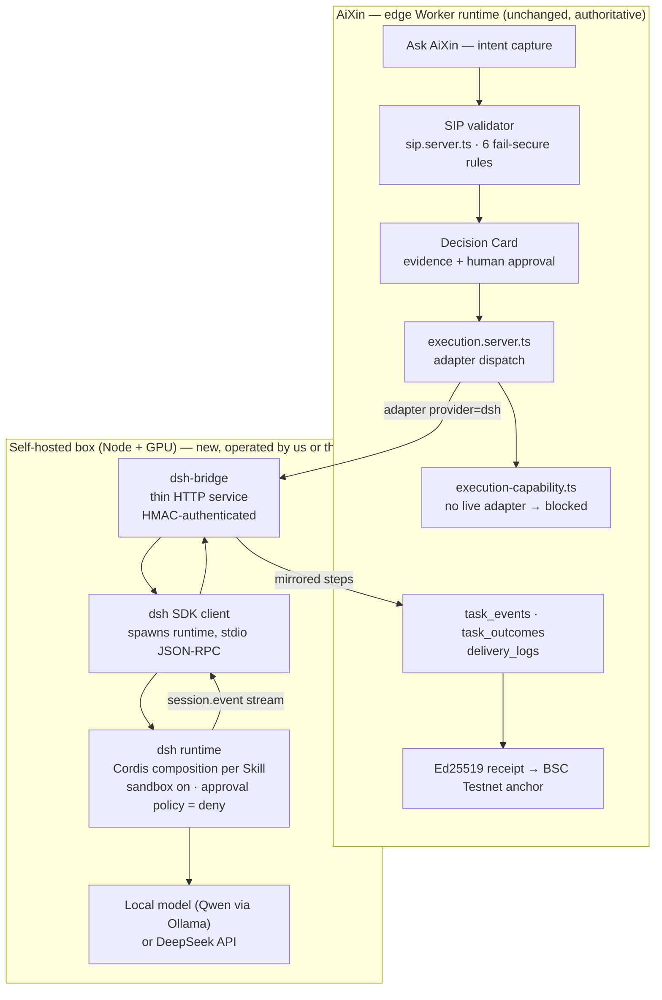
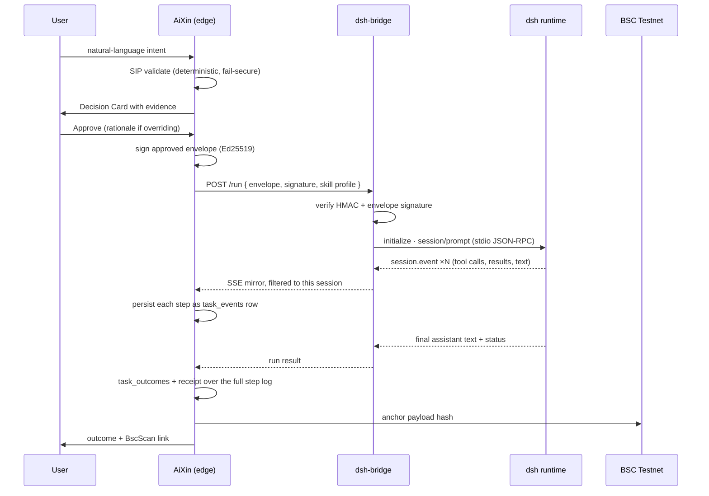
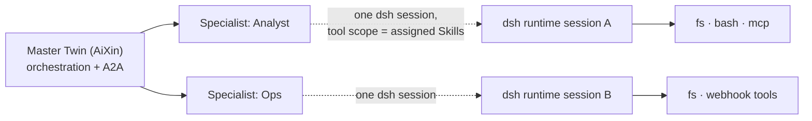
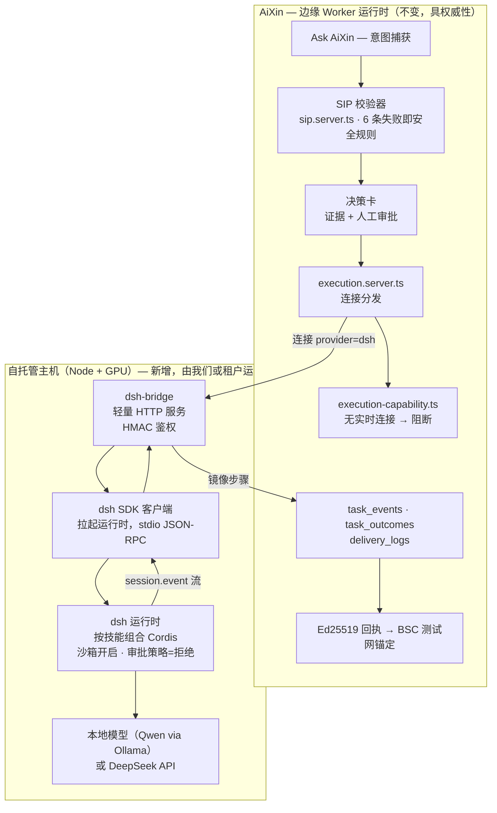
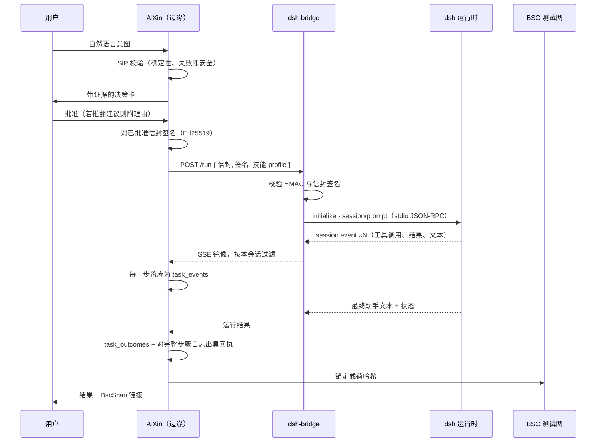
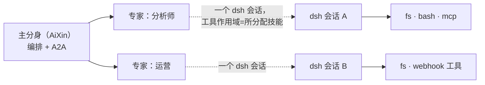

# AiXin × DeepSeek Harness — Integration Design

**Status:** design document, analysis only. No code in `src/` changes because of this file.
**Companion:** [`AIXIN_VS_DSH.md`](./AIXIN_VS_DSH.md) (what dsh is, side-by-side comparison).
**Reviewed against:** `github.com/deepseek-ai/deepseek-harness`, default branch `master`, reviewed 21 Aug 2026. Licence: MIT.

English | [中文见下](#中文版)

---

## 0. The question this answers

> Should AiXin borrow the dsh framework, or integrate with dsh through its headless mode and SDK, so that digital twins created in AiXin get a powerful harness and composable skills via dsh plugins?

Short answer:

1. **Do not rebuild AiXin on dsh.** It cannot run where AiXin's server code runs, and it would invert the product.
2. **Do integrate dsh as an optional *execution runtime*** behind the adapter seam that already exists — for self-hosted deployments only.
3. **Do borrow two design ideas natively**, which pay off with or without dsh.

Everything below is the evidence for those three claims, including the parts that are inconvenient.

---

## 1. What dsh actually is (verified, not remembered)

DeepSeek Harness (`dsh`) is an MIT-licensed TypeScript monorepo that provides an **agent harness**: the loop, the tool catalogue, session persistence, and the UIs around them. It is not a model and not an application. It is built on **Cordis**, a plugin/DI substrate where plugins contribute services, typed events and reversible effects to a shared `ctx`.

Package families that matter for this decision (all read from `packages/*/README.md`):

| Family | What it gives us |
|---|---|
| `core`, `llm`, `session`, `context`, `compaction` | The agent spine: loop, model routing, durable session log, context compaction |
| `shell`, `fs`, `subprocess`, `terminal`, `lsp`, `code-runtime` | The real tool power — bash, files, PTY, language servers, code execution |
| `skill` (`skill`, `skill-filesystem`, `tool-skill`) | Provider-neutral skill catalogue + a model-facing `skill` loader tool |
| `subagent` (+ `subagent-inprocess`, `subagent-spawn-in-process`, `subagent-acp`, `subagent-dsh-sdk`) | Child agents with their own scope, in-process or out-of-process |
| `guard` (`repeat-tool-reminder`, `timeout-policy`) | Loop-hygiene guards and per-call deadlines |
| `mcp` | MCP client — the same protocol our OpenClaw demo ledger already speaks |
| `sandbox`, `e2b` | Sandbox mode; E2B overlay swaps FS/subprocess providers into a remote sandbox |
| `sdk` (`protocol`, `client`, `server`) | Driving a harness runtime **from another process** |
| `acp` | Agent Client Protocol server — automation-only interoperability transport |
| `api` (Typert API Gateway) | `@Remote` methods over the Connection RPC / `/api` route — this is the **web GUI's** host↔browser channel |
| `client`, `host`, `web`, `apps/web`, `apps/cli` | The dsh product surfaces themselves |

### 1.1 Correction to an earlier statement

In conversation I referred to a "client SDK". To be precise:

- `packages/client/` is **the browser half of the dsh web GUI** (`@deepseek-ai/dsh-client-*`). It is not an integration SDK for third parties.
- `packages/sdk/` **is** the integration surface: `protocol` (wire types), `client` (TypeScript `DeepSeekHarness` / `HarnessClient`), `server` (the `jsonrpc` plugin). There is also a Python SDK at `python/` published as `deepseek-harness`.

This distinction changes the integration architecture, so it is stated up front rather than buried.

### 1.2 The two real entry points

**Headless CLI** — `examples/headless-agent` documents `pnpm dsh --profile headless "<task>"`: accepts one nonblank task, creates and persists a fresh session, prints the final assistant text, exits. Its README is explicit that the JSONL event stream used by its snapshot suites is *test infrastructure, not a supported CLI output format*. So the headless CLI gives us a final answer, not a trustworthy event feed.

**SDK runtime** — `packages/sdk/server` serves **newline-delimited JSON-RPC 2.0 over stdio**. `packages/sdk/client` spawns the runtime **as a subprocess** (`launch: { command, args }`) and owns it across `run()` calls. The wire surface is small and fully enumerated in `packages/sdk/protocol`:

| Direction | Method |
|---|---|
| client→server | `initialize`, `session/prompt`, `shutdown` |
| server→client | `session.event`, `session.status`, `subagent.started`, `subagent.finished` |

That table is the whole contract. Three consequences we cannot wish away:

- **It is stdio, not HTTP.** A caller must be able to spawn and hold a child process.
- **There is no approval method on the wire.** An out-of-process caller *cannot* answer a dsh approval prompt. dsh's own `user-approval` subsystem is in-process and fail-closed; over the SDK it can only resolve to unavailable/rejected.
- **`session.event` is unfiltered** (every session in the runtime) and `subagent.finished` is forwarded **for in-process runs only**. Anything we persist has to be filtered and reconciled on our side.

---

## 2. Why we cannot rebuild AiXin on dsh

### 2.1 Runtime mismatch — this one is fatal, not a preference

AiXin's server code (`createServerFn`, SSR, `src/routes/api/*`) runs in a **serverless edge Worker runtime**. In that runtime `child_process` is a non-functional stub, there is no real OS filesystem, and there is no long-lived process. dsh's value *is* bash, PTY, LSP, subprocess and a persistent session process. Its SDK transport *is* spawning a subprocess.

There is no version of "import dsh into a server function" that works. Any integration therefore requires a **second, separately operated Node service**. That is the honest cost, stated before the benefits.

### 2.2 Product inversion

AiXin's differentiator is not the loop. It is that a consequential action passes SIP validation (`src/lib/sip.server.ts`, six fail-secure rules), surfaces as an evidence-bearing Decision Card, produces an Ed25519 receipt (`src/lib/receipt-signer.server.ts`), and is anchored to BSC Testnet (`src/lib/anchor.server.ts`) so a third party who trusts neither the model nor us can verify it.

dsh's approval is excellent *in-process* engineering — fail-closed, audited as an `approval/asked` + `approval/decided` pair. But it is one plugin among peers, with no privileged core by design. If dsh owns the loop, governance becomes composable, and composable governance is removable governance. That is the opposite of a trust layer.

### 2.3 Maturity

dsh is a developer preview. MIT licence, active monorepo, but the packages are moving. Depending on it *optionally, behind a seam* is prudent. Making it the spine of a system we are taking to testnet and putting in front of BangBang is not.

---

## 3. Why integrate anyway

The honest gap in AiXin today: a Specialist Twin can only do what a hand-written executor branch in `src/lib/execution.server.ts` supports — refund, briefing, forecast. `src/lib/execution-capability.ts` is deliberately strict about this: no live adapter means `blocked` / `no_live_adapter` and a "draft, not executed" artifact. That honesty rule is right, and it is also a ceiling. Every new capability today is a code change by us.

dsh removes that ceiling without us building a plugin substrate:

- Real tools (files, shell, code, LSP) that we will not write ourselves.
- A skill catalogue with a model-facing loader — our `SKILL.md` manifests map onto it.
- Subagents with their own tool scope — the missing enforcement layer under Specialist Twins.
- MCP client — reuses the protocol our demo ledger already speaks.
- Sandbox + E2B overlay — a credible containment story for shell access.

So: **dsh becomes an adapter, not the framework.**

---

## 4. Target architecture



Read the boundary literally: **SIP is upstream of dsh, always.** dsh only ever receives an intent a human already approved. It never decides whether something is allowed.

### 4.1 Why a bridge service exists at all

Because the SDK is stdio and the caller must own a subprocess, and an edge Worker can do neither. `dsh-bridge` is the smallest thing that closes that gap:

- Holds one `DeepSeekHarness` instance per Skill profile, spawned lazily, reaped on close.
- Exposes two HTTP endpoints to AiXin: `POST /run` (accepts an approved intent envelope, returns a run id) and `GET /runs/:id/events` (SSE mirror of that run's `session.event` frames, filtered to the run's session id).
- Authenticates with the same HMAC-SHA256 scheme the signed webhook adapter already uses (`src/lib/webhook.server.ts`), so we are not inventing a second auth story.
- Refuses any request whose envelope is not accompanied by a valid AiXin approval signature.

This is real work — roughly a small service, not a weekend — and it is the main cost line of the integration.

### 4.2 Turn flow



### 4.3 Where a Skill's dsh plugins come from

Today `SKILL.md` declares intent and steps. The integration adds an optional block that names a dsh composition:

```yaml
runtime: dsh
profile: aixin-analyst
plugins:
  - dsh-fs-local
  - dsh-bash-local
  - dsh-tool-skill
  - dsh-mcp
```

`dsh-bridge` maps `profile` to a `cordis.yml` on disk. It does **not** accept arbitrary plugin lists from the wire — a tenant-supplied plugin name is remote code selection, and that would hand an attacker shell on the GPU box. Profiles are files an operator installs, and the wire may only reference one by name. This constraint is non-negotiable and is the security core of the design.

That is what "composable Skills via dsh plugins" means concretely: composition happens at deploy time on the box, and AiXin selects among installed compositions.

### 4.4 Specialist Twins as subagents



Delegation stays in AiXin. What moves into dsh is **scope enforcement**: today a Specialist's "assigned skills" is a display and routing concept; with one dsh session per Specialist, a Twin literally cannot call a tool outside its composition.

Caveat from the protocol: `subagent.finished` is forwarded for in-process runs only. If we later use out-of-process subagent providers, completion has to be reconciled from `session.event`, not assumed.

---

## 5. The governance boundary, stated precisely

| Concern | Owner | Why |
|---|---|---|
| Is this action allowed? | **AiXin SIP** | Deterministic, fail-secure, no LLM in the decision |
| Did a human approve it? | **AiXin Decision Card** | Evidence-bearing, records override rationale |
| What was actually done? | **dsh** | It runs the tools |
| Is there proof? | **AiXin** | Ed25519 receipt over the mirrored step log, anchored to BSC |
| Can dsh approve anything itself? | **No** | Approval policy set to deny; no approval method exists on the SDK wire anyway |

The last row is load-bearing and is also a limitation, not a feature we designed: because the SDK protocol has no approval channel, **any dsh tool that requests approval mid-run simply fails**. A run that needs a decision we did not pre-authorise dies and must come back through a fresh SIP cycle. That is the correct failure direction, but it does mean long interactive dsh flows are unavailable to us — we get one-shot, pre-authorised runs.

`execution-capability.ts` keeps its rule unchanged: if no dsh adapter is connected, the task is `blocked` / `no_live_adapter`. Adding dsh never introduces a simulated success path.

---

## 6. What to borrow natively, independent of all of the above

Two changes are worth making in AiXin itself, because they improve the codebase even if dsh is never connected — and they are prerequisites for the integration.

**1. Dynamic per-agent tool registry.** `src/routes/api/chat.ts` declares a fixed Zod `tool()` catalogue as a literal. Replace it with a registry assembled per request from the caller's installed Skills and connected Adapters. Without this, a Skill can never contribute a tool, so §4.3 is impossible.

**2. Interceptor seam for SIP.** Today SIP is called from inside individual tool bodies. A new tool can forget to call it. Move it to a uniform pre-execute hook over the tool loop — dsh's waterfall model (`tools/pre-execute` / `execute` / `post-execute`) is the reference. After this, forgetting is structurally impossible.

The other two borrows from `AIXIN_VS_DSH.md` — log-derived prompts ("model-visible means logged") and real subagents — only pay off once dsh is in, and are scheduled with it.

---

## 7. Brutally honest assessment

**What this genuinely buys**
- Tool capability we would otherwise spend months writing, under MIT licence.
- A path to provably complete traces: dsh already emits the step log; we sign it.
- Real scope enforcement for Specialist Twins.

**What it genuinely costs**
- A second runtime to operate, patch and secure — a Node service on the GPU box, beside Ollama. It can run shell. That is a serious security surface, mitigated by sandbox mode, operator-installed profiles, and the E2B overlay, but not eliminated.
- Ongoing churn: dsh is a developer preview and its packages move.
- The SDK's stdio transport means the bridge, not dsh, is the thing we must build and maintain.

**Where I am uncertain, and will not pretend otherwise**
- I read the repository's READMEs and docs. I have not run dsh, have not benchmarked it, and have not measured how well `session.event` maps onto our `task_events` schema. Field-level mapping is unresolved and must be prototyped before the bridge is designed in detail.
- The E2B overlay is described in its own README as a provider-composition POC, "not a whole-harness migration". Treating it as a finished containment story would be wrong.
- Cost and latency of routing every governed execution through a second process are unmeasured.

**Should BangBang wait for this? No.** BangBang's trial P0 scope — photo recognition, math practice, AI tutoring — needs none of it and is deliverable on the current executor design by mid-September. Putting dsh on that critical path would add risk for capability the trial does not use.

**Recommendation.** Do §6 now (small, strictly improves the codebase). Schedule the dsh execution adapter in Phase 4 as an opt-in backend for self-hosted deployments. Prototype the `session.event` → `task_events` mapping before committing to the bridge design. Never make dsh required for a hosted AiXin tenant.

---

## 8. Sources

All statements about dsh come from `github.com/deepseek-ai/deepseek-harness` (branch `master`, reviewed 21 Aug 2026, MIT):
`packages/README.md`, `packages/sdk/README.md`, `packages/sdk/client/README.md`, `packages/sdk/server/README.md`, `packages/sdk/protocol/README.md`, `packages/client/README.md`, `packages/acp/README.md`, `packages/skill/README.md`, `packages/subagent/README.md`, `packages/guard/README.md`, `docs/api-gateway.md`, `examples/headless-agent/README.md`.

All statements about AiXin cite the file that implements them: `src/lib/sip.server.ts`, `src/lib/execution.server.ts`, `src/lib/execution-capability.ts`, `src/lib/receipt-signer.server.ts`, `src/lib/anchor.server.ts`, `src/lib/webhook.server.ts`, `src/routes/api/chat.ts`.

---

<a id="中文版"></a>

# 中文版 — AiXin × DeepSeek Harness 集成设计

**状态：** 设计文档，仅为分析。本文件不引起 `src/` 下任何代码变更。
**配套文档：** [`AIXIN_VS_DSH.md`](./AIXIN_VS_DSH.md)（dsh 是什么、逐项对比）。
**核对基准：** `github.com/deepseek-ai/deepseek-harness`，默认分支 `master`，核对日期 2026 年 8 月 21 日，MIT 许可证。

## 0. 本文回答的问题

> 我们应该借鉴 dsh 框架，还是通过它的无界面（headless）模式和 SDK 直接集成，让 AiXin 中创建的数字分身获得强大的执行外壳（harness）和可组合的 dsh 插件技能？

简短回答：

1. **不要在 dsh 之上重建 AiXin。** 它无法在 AiXin 服务端代码所处的运行时中运行，而且会颠倒产品定位。
2. **应把 dsh 作为可选的「执行运行时」集成**，接在已有的外部工具连接（adapter）接缝之后，且仅限自托管部署。
3. **应原生借鉴两项设计**，无论是否接入 dsh 都值得做。

下文是这三条结论的依据，包括不利的部分。

## 1. dsh 究竟是什么（逐项核实，非凭记忆）

DeepSeek Harness（`dsh`）是 MIT 许可的 TypeScript 单体仓库，提供**智能体执行外壳**：循环、工具目录、会话持久化及其界面。它不是模型，也不是应用。底座是 **Cordis** —— 插件向共享的 `ctx` 贡献服务、类型化事件与可回退副作用。

与本决策相关的包族（均读自 `packages/*/README.md`）：

| 包族 | 提供的能力 |
|---|---|
| `core`、`llm`、`session`、`context`、`compaction` | 智能体主干：循环、模型路由、持久会话日志、上下文压缩 |
| `shell`、`fs`、`subprocess`、`terminal`、`lsp`、`code-runtime` | 真正的工具能力：bash、文件、PTY、语言服务器、代码执行 |
| `skill`（`skill`、`skill-filesystem`、`tool-skill`） | 与实现无关的技能目录 + 面向模型的 `skill` 加载工具 |
| `subagent`（含 `subagent-inprocess`、`subagent-spawn-in-process`、`subagent-acp`、`subagent-dsh-sdk`） | 具备独立作用域的子智能体，可进程内或跨进程 |
| `guard`（`repeat-tool-reminder`、`timeout-policy`） | 循环卫生守卫与单次调用超时 |
| `mcp` | MCP 客户端 —— 与我们 OpenClaw 演示账本使用的协议相同 |
| `sandbox`、`e2b` | 沙箱模式；E2B 覆盖层把文件/子进程能力换成远程沙箱 |
| `sdk`（`protocol`、`client`、`server`） | **从另一个进程**驱动 harness 运行时 |
| `acp` | Agent Client Protocol 服务端 —— 仅用于自动化的互操作传输 |
| `api`（Typert API 网关） | `@Remote` 方法走 Connection RPC / `/api` 路由 —— 这是 **Web 界面**的宿主↔浏览器通道 |
| `client`、`host`、`web`、`apps/web`、`apps/cli` | dsh 自身的产品界面 |

### 1.1 对先前表述的更正

我在对话中提到过「客户端 SDK」。准确地说：

- `packages/client/` 是 **dsh Web 界面的浏览器一侧**（`@deepseek-ai/dsh-client-*`），不是给第三方用的集成 SDK。
- `packages/sdk/` 才**是**集成入口：`protocol`（协议类型）、`client`（TypeScript 的 `DeepSeekHarness` / `HarnessClient`）、`server`（`jsonrpc` 插件）。另有 Python SDK 位于 `python/`，包名 `deepseek-harness`。

这个区别会改变集成架构，因此前置说明，不作淡化处理。

### 1.2 两个真实入口

**无界面 CLI** —— `examples/headless-agent` 记载 `pnpm dsh --profile headless "<任务>"`：接受一条非空任务，创建并持久化一个全新会话，打印最终助手文本后退出。其 README 明确指出，快照测试所用的 JSONL 事件流是*测试基础设施，不是受支持的 CLI 输出格式*。因此无界面 CLI 只给出最终答案，不提供可信的事件流。

**SDK 运行时** —— `packages/sdk/server` 通过 **stdio 上的换行分隔 JSON-RPC 2.0** 提供服务。`packages/sdk/client` 把运行时**作为子进程**拉起（`launch: { command, args }`）并在多次 `run()` 之间持有它。协议面很小，`packages/sdk/protocol` 已完整列举：

| 方向 | 方法 |
|---|---|
| 客户端→服务端 | `initialize`、`session/prompt`、`shutdown` |
| 服务端→客户端 | `session.event`、`session.status`、`subagent.started`、`subagent.finished` |

这张表就是全部契约。由此有三条无法回避的后果：

- **它是 stdio，不是 HTTP。** 调用方必须能够拉起并持有子进程。
- **协议上没有审批方法。** 跨进程调用方*无法*回应 dsh 的审批请求。dsh 自身的 `user-approval` 子系统是进程内、失败即拒绝的；经 SDK 只能落到不可用/被拒绝。
- **`session.event` 未经过滤**（运行时内所有会话），且 `subagent.finished` **仅对进程内运行**转发。我们要持久化的一切都必须在自己这一侧过滤与对账。

## 2. 为什么不能在 dsh 之上重建 AiXin

### 2.1 运行时不兼容 —— 这是硬性阻断，不是偏好

AiXin 的服务端代码（`createServerFn`、SSR、`src/routes/api/*`）运行在**无服务器边缘 Worker 运行时**中。该运行时里 `child_process` 是无效桩，没有真实操作系统文件系统，也没有长驻进程。而 dsh 的价值*恰恰*是 bash、PTY、LSP、子进程与常驻会话进程；它的 SDK 传输*恰恰*是拉起子进程。

「把 dsh 引入服务端函数」没有任何可行版本。因此任何集成都需要**第二个独立运维的 Node 服务**。这是诚实的成本，先于收益陈述。

### 2.2 产品定位被颠倒

AiXin 的差异化不在循环，而在于：一项有后果的操作必须通过 SIP 校验（`src/lib/sip.server.ts`，六条失败即安全规则）、以带证据的决策卡呈现、生成 Ed25519 回执（`src/lib/receipt-signer.server.ts`）、并锚定到 BSC 测试网（`src/lib/anchor.server.ts`），使既不信任模型也不信任我们的第三方能够独立验证。

dsh 的审批在*进程内*是优秀工程 —— 失败即拒绝，并以 `approval/asked` + `approval/decided` 成对审计。但它按设计只是众多平级插件之一，没有特权内核。若由 dsh 掌管循环，治理就变成可组合的；而可组合的治理即是可移除的治理。这与信任层的目标正好相反。

### 2.3 成熟度

dsh 是开发者预览版。MIT 许可、仓库活跃，但各包仍在变动。*可选地、置于接缝之后*依赖它是审慎的；把它作为我们即将上测试网、并交付给 BangBang 的系统主干，则不是。

## 3. 那么为什么仍要集成

AiXin 今天真实存在的短板：专家分身只能做 `src/lib/execution.server.ts` 中手写执行分支所支持的事 —— 退款、简报、预测。`src/lib/execution-capability.ts` 对此刻意严格：没有实时外部工具连接就判定 `blocked` / `no_live_adapter`，并产出「草稿（未执行）」制品。这条诚实规则是对的，同时也是天花板：今天每新增一项能力，都要我们改代码。

dsh 能在我们不自建插件底座的前提下移除这个天花板：

- 我们不会自己写的真实工具（文件、shell、代码、LSP）。
- 带面向模型加载器的技能目录 —— 我们的 `SKILL.md` 清单可以映射上去。
- 具备独立工具作用域的子智能体 —— 专家分身缺失的强制层。
- MCP 客户端 —— 复用演示账本已在使用的协议。
- 沙箱 + E2B 覆盖层 —— 对 shell 访问给出可信的隔离方案。

所以：**dsh 成为一个外部工具连接，而不是框架。**

## 4. 目标架构



边界请按字面理解：**SIP 永远在 dsh 上游。** dsh 收到的只能是人已批准的意图，它从不决定某事是否被允许。

### 4.1 为什么必须有桥接服务

因为 SDK 走 stdio 且调用方必须持有子进程，而边缘 Worker 两者都做不到。`dsh-bridge` 是弥合这一差距的最小实现：

- 每个技能 profile 持有一个 `DeepSeekHarness` 实例，惰性拉起，关闭时回收。
- 对 AiXin 暴露两个 HTTP 端点：`POST /run`（接收已批准的意图信封，返回运行 id）与 `GET /runs/:id/events`（该次运行 `session.event` 帧的 SSE 镜像，按会话 id 过滤）。
- 采用与已有签名 Webhook 连接相同的 HMAC-SHA256 方案（`src/lib/webhook.server.ts`）鉴权，不另造一套认证。
- 拒绝任何未附带有效 AiXin 审批签名的信封。

这是实打实的工作量 —— 大致是一个小型服务，不是一个周末，也是本次集成的主要成本项。

### 4.2 单轮流程



### 4.3 技能的 dsh 插件从哪里来

今天 `SKILL.md` 声明意图与步骤。集成后新增一个可选块，用于指定 dsh 组合：

```yaml
runtime: dsh
profile: aixin-analyst
plugins:
  - dsh-fs-local
  - dsh-bash-local
  - dsh-tool-skill
  - dsh-mcp
```

`dsh-bridge` 把 `profile` 映射到磁盘上的某个 `cordis.yml`。它**不接受**来自协议侧的任意插件列表 —— 租户提供的插件名等同于远程代码选择，那会把 GPU 主机的 shell 交给攻击者。profile 是运维人员安装的文件，协议侧只能按名称引用。此约束不可妥协，是本设计的安全核心。

这就是「通过 dsh 插件实现可组合技能」的具体含义：组合发生在主机的部署期，AiXin 只在已安装的组合中做选择。

### 4.4 专家分身作为子智能体



委派仍留在 AiXin。移入 dsh 的是**作用域强制**：今天「已分配技能」只是展示与路由概念；一个专家分身一个 dsh 会话之后，分身在物理上就无法调用其组合之外的工具。

协议层面的注意事项：`subagent.finished` 仅对进程内运行转发。若日后使用跨进程子智能体提供方，完成状态必须从 `session.event` 对账得出，不能假定。

## 5. 治理边界的精确表述

| 关注点 | 归属 | 原因 |
|---|---|---|
| 该操作是否被允许？ | **AiXin SIP** | 确定性、失败即安全，决策中没有 LLM |
| 是否有人批准？ | **AiXin 决策卡** | 带证据，并记录推翻建议的理由 |
| 实际做了什么？ | **dsh** | 工具由它执行 |
| 是否有证明？ | **AiXin** | 对镜像步骤日志出具 Ed25519 回执并锚定 BSC |
| dsh 能自行批准吗？ | **不能** | 审批策略设为拒绝；且 SDK 协议本就没有审批方法 |

最后一行既是承重设计，也是限制，而非我们主动设计的特性：由于 SDK 协议没有审批通道，**任何在运行中请求审批的 dsh 工具都会直接失败**。一次需要我们未预先授权之决策的运行会终止，并须经新一轮 SIP 重新发起。失败方向是正确的，但这也意味着长时间交互式的 dsh 流程对我们不可用 —— 我们只能获得一次性的、预授权的运行。

`execution-capability.ts` 的规则保持不变：若未连接 dsh，任务仍判 `blocked` / `no_live_adapter`。引入 dsh 绝不新增任何「模拟成功」的路径。

## 6. 无论如何都应原生借鉴的两项

以下两项即便永不接入 dsh 也值得在 AiXin 内部实施，且是集成的前置条件。

**1. 按智能体动态生成的工具注册表。** `src/routes/api/chat.ts` 目前以字面量声明固定的 Zod `tool()` 目录。应改为按请求、依据调用者已安装的技能与已连接的外部工具动态装配。没有这一步，技能永远无法贡献工具，第 4.3 节也无从谈起。

**2. SIP 的拦截器接缝。** 今天 SIP 由各个工具函数体内部调用，新增工具可能漏调。应改为在工具循环上统一的执行前钩子 —— dsh 的瀑布模型（`tools/pre-execute` / `execute` / `post-execute`）是参考实现。改造后，「漏调」在结构上不再可能。

`AIXIN_VS_DSH.md` 中的另外两项借鉴 —— 由日志推导提示词（「模型可见即已记录」）与真正的子智能体 —— 只有接入 dsh 后才见效，随其一并排期。

## 7. 毫不粉饰的评估

**真正的收益**
- 我们本需数月自研的工具能力，且是 MIT 许可。
- 通往可证明完整轨迹的路径：dsh 已产出步骤日志，我们对其签名。
- 专家分身真正意义上的作用域强制。

**真正的代价**
- 多一个需要运维、打补丁与加固的运行时 —— GPU 主机上与 Ollama 并存的 Node 服务，且它能执行 shell。这是严肃的安全面，沙箱模式、运维安装的 profile 与 E2B 覆盖层可缓解，但不能消除。
- 持续的变动：dsh 是开发者预览版，包结构仍在演进。
- SDK 的 stdio 传输意味着我们真正要建设与维护的是桥接服务，而不是 dsh 本身。

**我不确定、也不会假装确定的部分**
- 我阅读的是该仓库的 README 与文档。我没有实际运行过 dsh，没有做过基准测试，也没有衡量 `session.event` 与我们 `task_events` 结构的贴合度。字段级映射尚未解决，必须在详细设计桥接服务之前先做原型。
- E2B 覆盖层在其自身 README 中被描述为提供方组合的概念验证，「不是整体迁移」。把它当作成品级隔离方案是错误的。
- 让每次受治理的执行都经过第二个进程，其成本与时延尚未测量。

**BangBang 应该等这件事吗？不应该。** BangBang 试用版的 P0 范围 —— 拍照识别、数学练习、AI 辅导 —— 完全用不到它，按现有执行器设计可在 9 月中旬交付。把 dsh 放到该关键路径上，只会为试用版用不到的能力平添风险。

**建议。** 现在做第 6 节（改动小，且严格改善代码质量）。把 dsh 执行连接排入第 4 阶段，作为自托管部署的可选后端。在确定桥接设计之前，先原型验证 `session.event` → `task_events` 的映射。永远不要让托管版 AiXin 租户必须依赖 dsh。

## 8. 资料来源

关于 dsh 的全部陈述均来自 `github.com/deepseek-ai/deepseek-harness`（分支 `master`，2026 年 8 月 21 日核对，MIT）：
`packages/README.md`、`packages/sdk/README.md`、`packages/sdk/client/README.md`、`packages/sdk/server/README.md`、`packages/sdk/protocol/README.md`、`packages/client/README.md`、`packages/acp/README.md`、`packages/skill/README.md`、`packages/subagent/README.md`、`packages/guard/README.md`、`docs/api-gateway.md`、`examples/headless-agent/README.md`。

关于 AiXin 的全部陈述均标注实现文件：`src/lib/sip.server.ts`、`src/lib/execution.server.ts`、`src/lib/execution-capability.ts`、`src/lib/receipt-signer.server.ts`、`src/lib/anchor.server.ts`、`src/lib/webhook.server.ts`、`src/routes/api/chat.ts`。
