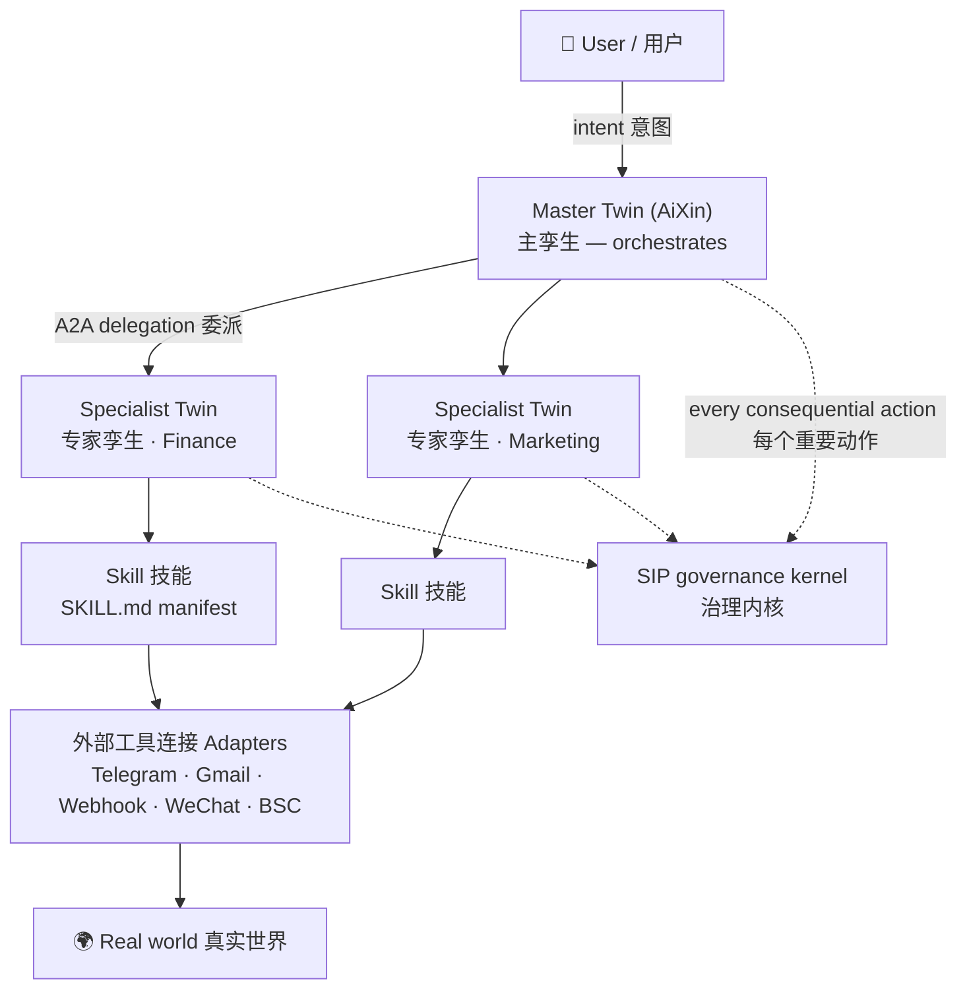
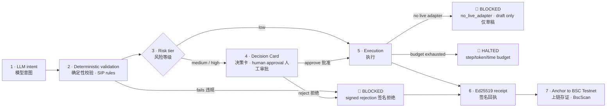

# AiXin Education Models & Curriculum (China)
### 信心 AiXin 教育模型与课程体系（中国）

**Version:** 1.0 · **Date:** 21 August 2026 · **Owner:** AiXin Protocol
**Audience:** community members (非技术), builders (技术), investors & partners (投资人/合作伙伴)

This document defines *how we teach AiXin in China* — the learning tracks, module content, hands-on
labs, diagrams and comparison tables — and pins every claim to the real delivery calendar so no
trainer, community lead or partner over-promises.

---

## 0. Truth calendar — what a module is allowed to promise

Everything taught here is tagged with one of three status labels. Trainers must read the label aloud.

| Label | Meaning | Where a learner can see it |
|---|---|---|
| 🟢 **Live** | Shipped and verifiable today | Live sandbox + BscScan |
| 🟡 **Sandbox by 31 Aug 2026** | Landing in the live sandbox this month | Sandbox build |
| 🔵 **Planned (by mid-Sep 2026 or later)** | Designed, on the roadmap, not built | ROADMAP.md only |

| Window | Platform state | Curriculum may teach as… |
|---|---|---|
| Now → **31 Aug 2026** | Remaining Phase 3.5 items + enhancement workstreams **W1 / W2 / W4 / W6** live in the sandbox | 🟡 Sandbox — demo it, label it sandbox |
| **1 → 15 Sep 2026** | Fixes + second enhancement pass; BangBang trial goes live | 🟡 → 🟢 as items are verified |
| After mid-Sep 2026 | **W5** marketplace commerce, **W3** self-hosted `dsh` runtime | 🔵 Planned — roadmap slide only, never a demo |

> Rule for every trainer: **if you cannot open a URL and show it, it is 🔵 Planned.**

---

## 1. The four learning tracks

```text
Track 1 — 入门 Foundation            (non-technical · 90 minutes · phone only)
  M1  What AiXin is: a trust layer, not another chatbot
  M2  Master Twin + Specialist Twins: the team model
  M3  The SIP pipeline: intent → validation → Decision Card → signed receipt → BSC
  M4  LAB: hatch a twin, install a skill, approve one card, open the receipt on BscScan

Track 2 — 构建 Builder               (technical · half day · laptop or GPU box)
  M5  Skills and SKILL.md manifests: public/private, free/paid, dev/live, versions
  M6  Dynamic tool registry + scope enforcement (W1/W2)
  M7  外部工具连接 Adapters: Telegram, Gmail, Webhook+HMAC, WeChat, BSC — and execution honesty
  M8  Run safety: step/token/time budgets, monthly cap, kill switch (W4)
  M9  Prompt traces (W6, 🟡); run replay (🔵 planned); dsh as an optional self-hosted runtime (W3, 🔵)
  M10 Self-hosting in China: GPU box + Qwen/Ollama, no cross-border dependency

Track 3 — 社区与投资 Community & Investor  (60 minutes · slides + 3 live moments)
  M11 Why governance is the moat
  M12 Marketplace economics: Twin Bundles, creator earnings, platform fee
  M13 Case study: BangBang built on AiXin
  M14 The ask: contribute a skill, run a box, or invest

Track 4 — 构建与变现 Build & monetise       (practical · 2 hours · laptop)
  M15 What twins can and cannot do: the honest capability matrix
  M16 Create your first twin in 30 minutes: a worked example
  M17 The OPC time-and-money map: what to delegate first and payback math
  M18 How twins are monetised: templates, pricing models, and buyers
  M19 Twin best practices and anti-patterns
  M20 Why AiXin commercially: vs OpenClaw, Hermes, and dsh
```

Recommended sequence for a new city/community: **Track 1 → (2 weeks) → Track 2 → Track 4 for
operators and builders → Track 3 for community leaders and investors.** Tracks 3 and 4 can also run
standalone. Full bilingual M15–M20 content, templates, capability boundaries, ROI and certification
are in **§16** and in the Academy at `/learn`.

---

## 2. The one-picture model (used in every track)



**Say it in one sentence (非技术版):** *AiXin gives you one digital twin that acts as your chief of
staff, hires specialist twins for specific jobs, and — this is the point — **cannot do anything
consequential without leaving a signed, publicly checkable receipt.***

---

## 3. Track 1 — 入门 Foundation (90 minutes)

### M1 · What AiXin is (15 min)

| Common belief | What AiXin actually is |
|---|---|
| "Another ChatGPT" | A **governance layer** that sits between an AI's intent and the real world |
| "It automates my work" | It automates work **and proves what it did**, to someone who trusts neither the model nor us |
| "Trust the AI" | **Don't** trust the AI. Trust the receipt. |

Three questions the module must leave answered:
1. Who decides? — **You do**, through a Decision Card.
2. What if the AI is wrong? — Deterministic validation blocks it *before* execution.
3. How do I prove it later? — Ed25519-signed receipt, hash anchored to BSC Testnet, public verify URL.

### M2 · Master Twin + Specialist Twins (20 min)

| Concept | Plain language | In the product |
|---|---|---|
| Master Twin 主孪生 | Your chief of staff. Named **AiXin** by default. One per account. | `/onboarding`, `/dashboard` |
| Specialist Twin 专家孪生 | A hired expert with a narrow job (finance, marketing, ops) | `/dashboard/specialists` |
| Skill 技能 | A capability you install onto a specialist — described by a `SKILL.md` manifest | `/dashboard/skills` |
| 外部工具连接 Adapter | The wire to the outside world (email, Telegram, WeChat, webhook, chain) | `/dashboard/adapters` |
| Delegation 委派 | Master hands a task to a specialist, with scope | Task detail thread |

Teaching trick that works: draw a company org chart. Master Twin = CEO's chief of staff.
Specialists = department heads. Skills = the tools on their desk. Adapters = the phone line out of
the building. SIP = the compliance officer who signs off before anything leaves.

### M3 · The SIP pipeline (25 min)



**The four teaching moments in this diagram** (these are what make people believe):
1. A **rejection is signed too** — refusing is an auditable act, not silence.
2. **No live adapter → BLOCKED**, and you get a clearly-labelled draft. AiXin never pretends it sent
   something it did not send. (`src/lib/execution-capability.ts`)
3. **Budget exhausted → HALTED with a reason**, never a silent stop. (`src/lib/run-budget.ts`)
4. Approving *against* a recommendation asks you for an **override rationale**, which is also signed.

### M4 · LAB (30 min, phone only, no VPN)

| Step | Learner does | Learner sees | Route |
|---|---|---|---|
| 1 | Sign in, hatch Master Twin | Twin named AiXin, ERC-8004 identity registered | `/onboarding` |
| 2 | Type a real intent in plain Chinese | Plan with filled slots, not a fabrication | `/dashboard/ask` |
| 3 | Install one free skill, assign to a specialist | Consent screen + `SKILL.md` manifest | `/dashboard/skills` |
| 4 | Approve one Decision Card | Evidence panel with real data, not vibes | `/dashboard/ask` |
| 5 | Reject a second card with a reason | Signed rejection in Governance | `/dashboard/governance` |
| 6 | Open the receipt on BscScan | Transaction hash, anyone can verify | `/verify/:sipId` |

**Completion criterion:** the learner can hand their phone to a stranger and the stranger can verify
the receipt without an AiXin account.

---

## 4. Track 2 — 构建 Builder (half day)

### M5 · Skills & manifests 🟢

A Skill is not a prompt. It is a declared capability with a manifest:

| Manifest field | Why it matters |
|---|---|
| name / category / description | Discovery in the marketplace |
| adapter (外部工具连接) | Which wire it needs; no adapter → execution is blocked, not faked |
| rules | Feeds the derived **capability contract**: SIP action, risk tier, approval requirement |
| visibility public/private · price free/paid · status dev/live · version | Lifecycle and marketplace |

Derived automatically by `src/lib/skill-manifest.ts` → `deriveCapabilityContract()`.

### M6 · Dynamic tool registry + scope enforcement (W1/W2) 🟡 *by 31 Aug 2026*

**Before vs after** — the single most important slide for technical audiences:

```text
BEFORE (fixed catalogue)
  request ─▶ hardcoded tool list in chat.ts ─▶ model
            (installing a Skill changed NOTHING the twin could do — it was display metadata)

AFTER  (W1 + W2)
  request ─▶ installed Skills ∩ assignments to Specialists
            ─▶ per-request registry of scoped tool descriptors   (src/lib/tool-registry.ts)
            ─▶ exposed via tool_search / tool_invoke meta-tools   (src/routes/api/chat.ts)
            ─▶ model sees a small, relevant catalogue that grows without blowing up context
  unassigned or uninstalled skill ─▶ FAIL CLOSED with a machine-readable reason
                                     ("unknown_tool" | "not_in_scope") — never a silent success
```

| Rule | Code |
|---|---|
| An install alone grants nothing — assignment to a Specialist is required | `buildSkillToolDescriptors()` |
| A tool call outside scope is a *blocked event*, not an error message the model can talk around | `resolveToolInScope()` |
| Large catalogues stay cheap via search-then-invoke | `searchDescriptors()` |
| SIP cannot be skipped by a new tool — one shared validation path | `src/lib/delegation.server.ts` |

### M7 · Adapters and execution honesty 🟢

| Adapter | Transport | Governance note |
|---|---|---|
| Telegram | Bot API, per-user token | Two-way task thread with the Master Twin |
| Gmail | OAuth | Real delivery; delivery logged per task |
| Webhook | HTTPS + **HMAC-SHA256** signature | The generic escape hatch for enterprises |
| WeChat 微信 | Official Account / Mini Program webhook | The China channel; BangBang uses it |
| BSC | JSON-RPC | Anchoring + ERC-8004 identity |

Everything lands in `delivery_logs`, visible on both `/dashboard/adapters` and the task detail page.
**Teaching point:** observability is not a nice-to-have — "did it actually send?" is the question
that destroys trust in every other agent product.

### M8 · Run safety (W4) 🟡 *by 31 Aug 2026*

| Guard | Default | Behaviour when hit |
|---|---|---|
| Steps per run | 25 | HALTED · `max_steps` |
| Tokens per run | 120,000 | HALTED · `max_tokens` |
| Wall clock per run | 180 s | HALTED · `max_wall_clock` |
| Tokens per month (workspace) | 5,000,000 | Pre-flight refusal · `monthly_cap` |
| Kill switch (operator pause) | off | Pre-flight refusal · `paused` |

Surfaced in **Organisation → Run safety** (`RunSafetyCard.tsx`), every run writing steps / tokens /
duration / stop reason to `run_usage`. Rules are pure and unit-tested (`src/lib/run-budget.ts`,
`run-budget.test.ts`) so a trainer can show the tests as proof.

**Why builders care:** a runaway loop is a financial event. This is also the meter that makes
marketplace pricing honest later.

### M9 · Prompt traces, replay, and dsh 🟡 / 🔵

- **W6 prompt traces 🟡** — `prompt_traces` records the exact system prompt, tool names, registry
  counts and message count handed to the model. The invariant: *model-visible means logged.* This is
  what makes a run explainable after the fact instead of "the AI decided something".
- **Run replay 🔵 planned — do NOT demo it.** Tracing is built; replaying a stored trace against the
  model is not. Traces are the *precondition* for replay, not replay itself. Trainers must say
  "we log everything the model saw; deterministic re-run is on the roadmap".
- **W3 dsh bridge 🔵 planned, self-hosted only** — DeepSeek Harness runs as a Node process driving
  Cordis plugins over stdio with subprocess and filesystem access. AiXin's cloud server runs on an
  edge Worker runtime with **no subprocess and no runtime module resolution**, so cloud tenants can
  never get a dsh session. Correct shape: **AiXin is the trust layer and the marketplace; dsh is one
  pluggable execution runtime behind the existing adapter seam**, available on GPU boxes.
  SIP stays upstream and authoritative; dsh's own approval channel is set to *deny*.
  Details: [`AIXIN_DSH_INTEGRATION.md`](./AIXIN_DSH_INTEGRATION.md), [`AIXIN_VS_DSH.md`](./AIXIN_VS_DSH.md).

### M10 · Self-hosting in China 🟢

Ubuntu or Windows 11 GPU box, Qwen via Ollama, local database, no cross-border egress required.
Runbooks: [`SELF_HOSTING.md`](./SELF_HOSTING.md) and [`DEPLOY_RUNBOOK.md`](./DEPLOY_RUNBOOK.md).
`src/lib/ai-gateway.server.ts` resolves the chat model from environment, so the same build runs
hosted or fully local with a pinned model id.

---

## 5. AiXin vs other agent systems (the technical comparison slide)

| Dimension | **AiXin** | DeepSeek Harness (dsh) | OpenClaw-style autonomous agent | Hermes-style local assistant |
|---|---|---|---|---|
| What it is | Trust layer + marketplace + governed runtime | A harness: loop + tools + session + UIs | An autonomous tool-using loop | A local model wrapper / assistant |
| Agent loop | `streamText` with step cap + budget guard | Cordis plugin waterfall, highly composable | Free-running until done | Single-turn or shallow loop |
| Tool registry | **Dynamic, per-request, scope-enforced** (W1/W2) | Dynamic via plugins | Static config file | Static |
| Approval | **Decision Cards; approval is the product**; rejections signed; override rationale captured | Fail-closed approval plugin (in-process) | Usually none, or a yes/no prompt | None |
| Audit trail | `task_events` + Ed25519 receipts + **BSC anchor** | In-process session log | Console output | None |
| Third-party verifiable | ✅ anyone can verify without trusting us | ❌ trust the operator's log | ❌ | ❌ |
| Execution honesty | Blocks with `no_live_adapter`; emits a labelled draft | N/A (real subprocess access) | Will happily claim success | N/A |
| Spend / loop safety | Steps + tokens + wall clock + monthly cap + kill switch | Operator-configured | Typically none | N/A |
| Multi-agent | Master Twin → Specialist Twins (A2A, scoped) | Experimental agent teams | Sub-agents ad hoc | No |
| Runtime | Edge Worker (cloud) or self-hosted GPU box | Node process, subprocess/filesystem | Node/Python host | Local desktop |
| Marketplace | Skills + Twin Bundles, versions, pricing | None | None | None |
| Maturity / licence | Production sandbox, testnet-anchored | MIT, developer preview | Varies, hobby→prod | Varies |

**The honest one-liner:** dsh optimises for *runtime composability*, with approval as one good
plugin. AiXin optimises for *third-party-verifiable governance*, where approval **is** the product.
An OpenClaw-style agent optimises for autonomy — which is exactly why it will happily issue the same
refund twice, and why our head-to-head demo uses precisely that trap.

---

## 6. Track 3 — 社区与投资 (60 minutes)

### M11 · Why governance is the moat

Model capability is commoditising monthly. What does not commoditise is a record a bank, a regulator,
a school, or a counterparty will accept. AiXin's defensibility is the **receipt trail plus the trust
graph built on top of it** (Phase 4), not any single model.

### M12 · Marketplace economics 🔵 *planned, W5*

| Role | Gives | Gets |
|---|---|---|
| Skill creator 技能创作者 | A live skill with a manifest | Revenue share on installs/usage |
| Twin bundler | A packaged Specialist + skills ("Twin Bundle") | Flat-price bundle sales |
| Operator (GPU box) | Self-hosted capacity in-region | Runs paid workloads locally |
| Platform | Governance, verification, distribution | Platform fee |

Sequencing that keeps us honest: **W4 metering ships first, pricing second.** We instrument real
token cost per loop before selling a flat subscription, otherwise pricing is blind.

### M13 · Case study — BangBang built on AiXin

An education app for students/parents/teachers, delivered through the WeChat channel, built **on**
AiXin rather than calling it: photo recognition, maths practice, AI tutoring, all under content
safety screening and the same SIP receipts. Trial target: **mid-September 2026**.
See [`BANGBANG_ON_AIXIN.md`](./BANGBANG_ON_AIXIN.md), [`BANGBANG_APP_PRD.md`](./BANGBANG_APP_PRD.md).

### M14 · The three live demo moments (never use slides for these)

1. **A rejection that produces a signed receipt.** Refusal is auditable.
2. **A blocked run: "no live adapter".** The system refuses to pretend. Nothing else on the market
   does this in front of an audience.
3. **A kill-switch / budget halt.** Money safety is visible, not promised.

---

## 7. Delivery formats

| Format | Track | Duration | Requirements | Notes |
|---|---|---|---|---|
| Community workshop 社区工作坊 | 1 | 90 min | Phone only, no VPN | WeChat-group friendly; 20–50 people |
| Builder bootcamp 开发者训练营 | 2 | Half day | Laptop; optional GPU box with Qwen | Works fully offline on a self-hosted box |
| Investor briefing 投资人简报 | 3 | 60 min | 15 slides + live sandbox | Three live moments are mandatory |
| Partner deep-dive | 2+3 | 3 hours | Sandbox tenant | For app teams like BangBang |

### Certification — "AiXin Skill Creator 技能创作者"

A learner is certified when they can show all five:

1. One live Skill with a valid `SKILL.md` manifest.
2. That skill installed **and assigned** to a Specialist Twin (proves they understand scope).
3. One approved Decision Card with a real evidence panel.
4. One signed **rejection** (proves they understand the governance point, not just the happy path).
5. One receipt verified on BscScan by someone else, via the public verify URL.

---

## 8. Trainer's verification table (feature → status → source of truth)

| Feature taught | Status | Implementation |
|---|---|---|
| SIP validation, risk tiering, signed rejections | 🟢 Live | `src/lib/sip.server.ts`, `src/lib/sip.functions.ts` |
| Ed25519 receipts + BSC anchoring + public verify | 🟢 Live | `receipt-signer.server.ts`, `anchor.server.ts`, `/verify/:sipId` |
| ERC-8004 twin identity | 🟢 Live | `src/lib/identity.server.ts` |
| Execution honesty (`no_live_adapter`) | 🟢 Live | `src/lib/execution-capability.ts` |
| Adapters + delivery logs | 🟢 Live | `execution.server.ts`, `delivery-log.server.ts` |
| Skill lifecycle + manifests | 🟢 Live | `src/lib/skill-manifest.ts`, `/dashboard/skills` |
| Dynamic tool registry (W1) | 🟡 Aug 2026 | `src/lib/tool-registry.ts`, `tool-registry.server.ts` |
| Skill scope enforcement (W2) | 🟡 Aug 2026 | `resolveToolInScope()` in `tool-registry.ts` |
| Run budgets + kill switch (W4) | 🟡 Aug 2026 | `src/lib/run-budget.ts`, `RunSafetyCard.tsx` |
| Prompt traces (W6) | 🟡 Aug 2026 | `prompt_traces`, `src/lib/run-budget.server.ts`, `src/routes/api/chat.ts` |
| Deterministic run replay | 🔵 Planned | not implemented — traces only |
| Marketplace commerce (W5) | 🔵 Planned | ROADMAP Phase 4 |
| `dsh-bridge` runtime (W3) | 🔵 Planned, self-hosted only | `AIXIN_DSH_INTEGRATION.md` |

Refresh this table at every roadmap change. **A curriculum that drifts from the product destroys
more trust than no curriculum at all.**

---

## 9. Module objectives & prerequisites (the missing contract)

Every module states what a learner can *do* afterwards. If the learner cannot perform the
"can-do" column unaided, the module failed — re-teach it, do not move on.

| Module | Prerequisite | After this module the learner can… | Evidence of success |
|---|---|---|---|
| M1 | none | explain in one sentence why AiXin is a trust layer, not a chatbot | says "it validates and receipts actions", unprompted |
| M2 | M1 | name who orchestrates vs who executes, and why one Master Twin | draws the team box diagram from memory |
| M3 | M2 | walk the five SIP stages in order and say where the human sits | orders 5 shuffled cards correctly |
| M4 | M3 | hatch a twin, install a skill, approve a card, open a receipt on BscScan | a BscScan tx page on their own phone |
| M5 | M4 | write a valid `SKILL.md` with scope, pricing, visibility, version | manifest passes `skill-manifest.ts` validation |
| M6 | M5 | explain why the model searches tools instead of receiving all of them | states the scope-enforcement failure it prevents |
| M7 | M6 | connect one adapter and read a delivery log | one real Telegram or Gmail delivery, logged |
| M8 | M7 | set a budget, trip it deliberately, read the stop reason | a `run_usage` row with a non-empty stop reason |
| M9 | M8 | read a prompt trace and state what is *not* yet built (replay) | correctly labels replay as planned |
| M10 | M8 | describe a fully local deployment with no cross-border dependency | names model source, DB, and egress = none |
| M11 | M1 | argue governance-as-moat against an autonomy pitch | handles two objections from §12 |
| M12 | M11 | explain creator earnings and platform fee, and flag it as planned | never presents W5 as live |
| M13 | M11 | describe BangBang as *built on* AiXin, not calling AiXin | uses the platform/tenant wording |
| M14 | M11–M13 | make one of the three asks with a concrete next step | a named commitment |
| M15 | M4 | distinguish what a live twin can, cannot, and refuses to do | correctly classifies five capability scenarios |
| M16 | M15 | create and test one scoped twin from a template | one real run, Decision Card, and receipt |
| M17 | M16 | rank OPC tasks by value and calculate payback | completed ROI worksheet with stated assumptions |
| M18 | M17 | choose a buyer, offer, and honest pricing model | one-page offer with live/planned dependencies labelled |
| M19 | M16 | apply scope, evidence, approval, observability, and budget best practices | passes the anti-pattern review exercise |
| M20 | M15 | explain when AiXin, OpenClaw, Hermes, or dsh is the right fit | comparison justified by governance and runtime needs |

## 10. Formative knowledge checks (2–3 per module, ask out loud)

Beginners fail silently. Ask these *mid-module*, not at the end. Correct answers in **bold**.

| Module | Check | Answer |
|---|---|---|
| M1 | Does AiXin make the AI smarter or the AI accountable? | **accountable** |
| M1 | If the model proposes nonsense, what stops it? | **deterministic validation, before execution** |
| M2 | How many Master Twins per account? | **exactly one** |
| M2 | Can a Specialist use a skill it was not assigned? | **no — scope enforcement** |
| M3 | Who approves a high-risk action? | **a human, on a Decision Card** |
| M3 | Is a rejection recorded? | **yes — signed, same as an approval** |
| M4 | What proves the action happened to a stranger? | **the public verify link / on-chain receipt** |
| M5 | Where is a skill's price and visibility declared? | **`SKILL.md` manifest** |
| M6 | Why not hand the model every tool? | **prompt bloat + out-of-scope calls** |
| M7 | What happens with no live adapter configured? | **the run halts as BLOCKED, it does not pretend** |
| M8 | Which budget stops an infinite loop? | **max steps (plus tokens/wall-clock)** |
| M9 | Can you replay a run today? | **no — traces only, replay is planned** |
| M10 | Does a local box need cross-border access? | **no** |
| M12 | Is marketplace payment live today? | **no — planned (W5)** |
| M15 | Can a twin execute without a live adapter? | **no — it blocks and labels the output as a draft** |
| M16 | What proves the tutorial twin completed a real action? | **delivery evidence plus a signed receipt** |
| M17 | What must an ROI claim include? | **hours saved, hourly value, run cost, and build-time assumptions** |
| M18 | Is marketplace bundle payment live? | **no — W5 is planned; service and build-fee models can be used today** |
| M19 | Should a specialist receive every available skill? | **no — grant the minimum scoped skills required** |
| M20 | Is dsh a replacement for SIP? | **no — it is a planned optional execution runtime behind AiXin governance** |

## 11. Glossary EN ↔ 中文 (use these words, never synonyms)

| English | 中文 | Plain meaning |
|---|---|---|
| Master Twin | 主孪生 | your single orchestrator; reads intent, delegates, never executes blind |
| Specialist Twin | 专家孪生 | a purpose-built worker twin with a limited set of skills |
| Skill | 技能 | a capability unit declared by a `SKILL.md` manifest |
| Adapter | 外部工具连接 | the connection to a real outside system (Telegram, Gmail, Webhook, WeChat, chain) |
| SIP (Signal Intent Protocol) | 信号意图协议 | intent → validation → approval → execution → receipt |
| Intent signal | 意图信号 | the strict JSON the model proposes; not an action |
| Decision Card | 决策卡 | the human approval surface, with evidence |
| Signed receipt | 签名回执 | Ed25519-signed record of what happened |
| Anchor | 上链锚定 | writing the receipt hash to BSC Testnet |
| Run budget | 运行预算 | step / token / time / monthly limits per run |
| Kill switch | 紧急停止开关 | operator pause for all runs |
| Prompt trace | 提示词轨迹 | the log of everything the model could see |
| Tool registry | 工具注册表 | searchable tool catalogue given to the model |
| Scope enforcement | 范围强制 | a twin may only invoke tools inside its assigned skills |

## 12. Objection handling (scripted answers — rehearse these)

| Objection | Honest answer |
|---|---|
| "Isn't this blockchain hype?" | The chain does one narrow job: making a receipt hash tamper-evident to a third party. Everything else — validation, approvals, execution — is ordinary server code and works without it. |
| "Why can't the AI just do it?" | It can, and that's the problem: an unaudited agent's mistake is indistinguishable from its success. We keep the model for judgement and give the action to deterministic code. |
| "This is slower than an autonomous agent." | For reversible actions we don't gate at all. Gating is for consequential actions, where a wrong move costs money or trust. |
| "Can you prove it, not just claim it?" | Yes — open a receipt's public verify link on your own device, no account needed. That's the whole point of the third live demo. |
| "What if OpenAI/DeepSeek is unavailable in my region?" | The model source is configurable; a GPU box with Qwen runs the same build locally (M10). |
| "Do you store my data abroad?" | Self-hosted deployments have no cross-border egress requirement; see the runbooks. |
| "Is the marketplace live?" | No. Skills, manifests and installs are live; paid commerce is planned (W5). Any trainer who says otherwise is wrong. |

## 13. Demo-failure fallbacks (assume the network will fail)

Three live moments are mandatory, so plan their failure explicitly.

| If this fails | Do this instead | Never do this |
|---|---|---|
| Sandbox slow / unreachable | switch to the pre-recorded 90-second screen capture, say plainly it's a recording | claim it's live |
| BscScan slow or blocked | show the app's own receipt panel + signature, then the public verify link; promise a follow-up link in the group chat | skip verification entirely |
| Anchoring pending (no tx yet) | teach the pending → confirmed → failed states as a feature: failure is recorded, not hidden | refresh repeatedly in silence |
| Adapter delivery doesn't arrive | open the delivery log and read the error out loud | blame the volunteer's phone |

Trainer kit checklist: recorded fallbacks for all three demos, one pre-seeded account with an existing
approved card + rejection + confirmed receipt, printed glossary, offline copy of this document.

## 14. Did it work? Post-workshop metrics

| Metric | Target per 20-person workshop | Where to read it |
|---|---|---|
| Learners who hatched a twin | ≥ 18 | twins created that day |
| Learners who approved a card **and** rejected one | ≥ 15 | governance history |
| Receipts verified by a *different* person | ≥ 10 | public verify hits |
| Skills published (Track 2) | ≥ 5 | skills with a valid manifest |
| Certifications issued within 2 weeks | ≥ 3 | certification artefacts |
| Modules where >30% failed the knowledge check | 0 | trainer's tally — rewrite those modules |

Review these numbers after every workshop and change the curriculum, not the audience.

## 15. Where learners find this online

The curriculum is published in-app at **`/learn`** (bilingual, mobile-first): module objectives,
interactive knowledge checks with instant feedback, hands-on exercises, the glossary, the FAQ, and a
self-serve certification checklist that tracks progress locally on the learner's device.

---
---

# 中文版 · AiXin 教育模型与课程体系

**版本：** 1.0 · **日期：** 2026 年 8 月 21 日 · **对象：** 社区成员（非技术）、开发者（技术）、投资人与合作伙伴

本文件定义 **AiXin 在中国如何被教学** —— 学习路径、模块内容、动手实验、图表与对比表，并把每一项主张
与真实的交付日历绑定，确保讲师、社区负责人与合作伙伴都不会过度承诺。

## 0 · 真实性日历 —— 每个模块可以承诺什么

| 标签 | 含义 | 学员在哪里能看到 |
|---|---|---|
| 🟢 **已上线** | 今天即可验证 | 线上沙盒 + BscScan |
| 🟡 **2026 年 8 月 31 日前进入沙盒** | 本月落地 | 沙盒版本 |
| 🔵 **规划中（2026 年 9 月中或之后）** | 已设计、在路线图上、尚未构建 | 仅 ROADMAP.md |

| 时间窗口 | 平台状态 | 课程可以如何讲 |
|---|---|---|
| 现在 → **2026-08-31** | 剩余 Phase 3.5 项目 + 增强工作流 **W1 / W2 / W4 / W6** 进入线上沙盒 | 🟡 沙盒 —— 可演示，但必须标明沙盒 |
| **2026-09-01 → 09-15** | 修复与第二轮增强；BangBang 试用版上线 | 逐项由 🟡 转 🟢 |
| 2026 年 9 月中之后 | **W5** 市场商业化、**W3** 自托管 `dsh` 运行时 | 🔵 规划中 —— 只能出现在路线图页，绝不演示 |

> 讲师铁律：**打不开链接、当场演示不了的，一律算 🔵 规划中。**

## 1 · 四条学习路径

```text
路径一 — 入门（非技术 · 90 分钟 · 只需手机）
  M1  AiXin 是什么：信任层，而不是又一个聊天机器人
  M2  主孪生 + 专家孪生：团队模型
  M3  SIP 治理流水线：意图 → 校验 → 决策卡 → 签名回执 → 上链
  M4  实验：孵化孪生、安装技能、批准一张决策卡、在 BscScan 上打开回执

路径二 — 构建（技术 · 半天 · 笔记本或 GPU 机器）
  M5  技能与 SKILL.md 清单：公开/私有、免费/付费、开发/上线、版本
  M6  动态工具注册表 + 范围强制（W1/W2）
  M7  外部工具连接：Telegram、Gmail、Webhook+HMAC、微信、BSC —— 以及执行诚实性
  M8  运行安全：步数/token/时长预算、月度上限、紧急停止开关（W4）
  M9  提示词轨迹（W6，🟡）；运行回放（🔵 规划中）；dsh 作为可选的自托管运行时（W3，🔵）
  M10 中国本地部署：GPU 机器 + Qwen/Ollama，无需跨境依赖

路径三 — 社区与投资（60 分钟 · 幻灯片 + 三个现场时刻）
  M11 为什么治理才是护城河
  M12 市场经济模型：Twin 套装、创作者收益、平台费
  M13 案例：BangBang 构建在 AiXin 之上
  M14 邀请：贡献技能、运行一台机器、或参与投资

路径四 — 构建与变现（实操 · 2 小时 · 笔记本）
  M15 孪生能做什么、不能做什么：诚实能力清单
  M16 30 分钟创建第一个孪生：完整示例
  M17 一人公司的时间与成本地图：先委派什么、如何计算回本
  M18 孪生如何变现：模板、定价模式与买家
  M19 孪生最佳实践与反模式
  M20 商业上为什么选择 AiXin：对比 OpenClaw、Hermes 与 dsh
```

新城市/新社区建议顺序：**路径一 →（两周后）路径二 → 面向经营者和开发者的路径四 → 面向社区负责人和投资人的路径三。**
路径三和路径四也可独立开设。M15–M20 的完整双语内容、模板、能力边界、ROI 与认证见**第 16 节**及应用内 `/learn`。

## 2 · 一张图讲清模型

**一句话（非技术版）：** *AiXin 给你一个数字孪生作为"办公室主任"，它会为具体工作雇用专家孪生；关键在于
—— **任何有后果的动作，都必须留下一张可被公开核验的签名回执，否则做不了。***

（图示同英文版：用户 → 主孪生 → 专家孪生 → 技能 → 外部工具连接 → 真实世界，SIP 治理内核横切所有环节。）

## 3 · 路径一 · 入门（90 分钟）

### M1 · AiXin 是什么（15 分钟）

| 常见误解 | AiXin 实际是什么 |
|---|---|
| "又一个 ChatGPT" | 位于 AI 意图与真实世界之间的**治理层** |
| "它帮我自动化工作" | 它自动化工作，**并且证明它做了什么** —— 证明给既不信任模型、也不信任我们的人看 |
| "要相信 AI" | **不要**相信 AI。相信回执。 |

三个必须讲清的问题：谁做决定？——**你**，通过决策卡。AI 错了怎么办？——确定性校验在执行**之前**拦截。
事后如何举证？——Ed25519 签名回执 + BSC 测试网存证 + 公开验证链接。

### M2 · 主孪生与专家孪生（20 分钟）

| 概念 | 通俗说法 | 产品位置 |
|---|---|---|
| 主孪生 | 你的办公室主任，默认名为 **AiXin**，每账户一个 | `/onboarding`、`/dashboard` |
| 专家孪生 | 被雇来做某一类具体工作的专家（财务、市场、运营） | `/dashboard/specialists` |
| 技能 | 安装到专家孪生上的能力，由 `SKILL.md` 清单描述 | `/dashboard/skills` |
| 外部工具连接 | 通往外部世界的线路（邮件、Telegram、微信、Webhook、链上） | `/dashboard/adapters` |
| 委派 | 主孪生把任务连同权限范围交给专家孪生 | 任务详情对话 |

好用的教学类比：画一张公司组织架构图。主孪生＝办公室主任，专家孪生＝部门负责人，技能＝他们桌上的工具，
外部工具连接＝对外的电话线，SIP＝在任何东西发出去之前签字的合规官。

### M3 · SIP 治理流水线（25 分钟）

流程：模型意图 → 确定性校验（违规则**签名拒绝**）→ 风险分级 → 中高风险进入**决策卡**人工审批 →
执行（无可用连接则 `no_live_adapter` 拦截并只产出标注清楚的草稿；预算耗尽则 HALTED）→ Ed25519 签名回执
→ BSC 测试网存证。

四个最能建立信任的教学点：
1. **拒绝也会被签名** —— 拒绝是可审计的行为，而不是沉默。
2. **没有可用连接就拦截**，并明确给出"草稿，未执行"。AiXin 绝不假装自己发出了实际没有发出的东西。
3. **预算耗尽会带原因停止**，绝不静默中断。
4. 在系统建议拒绝时仍选择批准，会要求你填写**覆盖理由**，该理由同样被签名。

### M4 · 实验（30 分钟 · 只用手机 · 无需 VPN）

| 步骤 | 学员操作 | 学员看到 | 路由 |
|---|---|---|---|
| 1 | 登录并孵化主孪生 | 名为 AiXin 的孪生，ERC-8004 身份已注册 | `/onboarding` |
| 2 | 用中文输入一个真实意图 | 带有已填写要素的计划，而非编造 | `/dashboard/ask` |
| 3 | 安装一个免费技能并指派给专家孪生 | 授权确认页与 `SKILL.md` 清单 | `/dashboard/skills` |
| 4 | 批准一张决策卡 | 基于真实数据的证据面板 | `/dashboard/ask` |
| 5 | 带理由拒绝第二张卡 | 治理页中的签名拒绝记录 | `/dashboard/governance` |
| 6 | 在 BscScan 打开回执 | 交易哈希，任何人可核验 | `/verify/:sipId` |

**通过标准：** 学员把手机递给一个陌生人，对方无需 AiXin 账号即可核验这张回执。

## 4 · 路径二 · 构建（半天）

### M5 · 技能与清单 🟢
技能不是一段提示词，而是一份声明式能力清单：名称/类别/描述（用于市场发现）、外部工具连接（缺失即拦截而
非伪造）、规则（推导出 SIP 动作、风险等级、是否需要审批）、可见性与价格与状态与版本（生命周期与市场）。

### M6 · 动态工具注册表与范围强制（W1/W2）🟡 *8 月 31 日前*

**改造前：** 工具清单硬编码在 `chat.ts` 里，安装一个技能**什么也不会改变** —— 那只是展示用的元数据。
**改造后：** 按请求实时构建注册表＝（已安装技能 ∩ 已指派给专家孪生的技能），通过 `tool_search` /
`tool_invoke` 元工具暴露给模型，目录再大也不会撑爆上下文；未安装或未指派的技能一律**失败关闭**并给出
机器可读原因（`unknown_tool` / `not_in_scope`），绝不静默成功。SIP 校验集中在一条共享路径上，新工具在结构上
无法绕过治理。

### M7 · 外部工具连接与执行诚实性 🟢

| 连接 | 传输 | 治理要点 |
|---|---|---|
| Telegram | Bot API，每用户独立令牌 | 与主孪生的双向任务对话 |
| Gmail | OAuth | 真实投递，按任务记录投递日志 |
| Webhook | HTTPS + **HMAC-SHA256** 签名 | 面向企业的通用出口 |
| 微信 | 公众号 / 小程序 webhook | 中国渠道，BangBang 即基于此 |
| BSC | JSON-RPC | 存证与 ERC-8004 身份 |

全部写入 `delivery_logs`，在外部工具连接页与任务详情页均可见。**教学要点：** 可观测性不是加分项 ——
"到底发出去没有？"这个问题，足以摧毁市面上其他所有智能体产品的可信度。

### M8 · 运行安全（W4）🟡 *8 月 31 日前*

| 守卫 | 默认值 | 触发后行为 |
|---|---|---|
| 单次运行步数 | 25 | 停止 · `max_steps` |
| 单次运行 token | 120,000 | 停止 · `max_tokens` |
| 单次运行时长 | 180 秒 | 停止 · `max_wall_clock` |
| 每月 token（工作区） | 5,000,000 | 运行前拒绝 · `monthly_cap` |
| 紧急停止开关 | 关闭 | 运行前拒绝 · `paused` |

在**组织 → 运行安全**中呈现，每次运行都会把步数/token/时长/停止原因写入 `run_usage`。规则为纯函数并有
单元测试，讲师可以直接把测试当作证据展示。**开发者关心的原因：** 失控循环是一次财务事故；同时这套计量
也是后续市场定价诚实的基础。

### M9 · 提示词轨迹、回放与 dsh 🟡 / 🔵
- **W6 提示词轨迹 🟡** —— 记录交给模型的系统提示词、工具名、注册表规模与消息数。不变式：*模型能看到的，
  一定被记录*。这让运行事后可解释，而不是"AI 自己决定的"。
- **运行回放 🔵 规划中 —— 请勿现场演示。** 轨迹已实现，"用轨迹重跑模型"尚未实现。轨迹是回放的前提，
  不等于回放。讲师应表述为："模型看到的一切都被记录，确定性重跑在路线图上。"
- **W3 dsh 桥接 🔵 规划中，仅自托管** —— dsh 是通过 stdio 驱动 Cordis 插件、需要子进程与文件系统的 Node 进程；
  AiXin 云端运行在边缘 Worker 运行时，**没有子进程、没有运行时模块解析**，云端租户根本无法获得 dsh 会话。
  正确形态是：**AiXin 是信任层与市场，dsh 是接在既有连接层后面的一种可插拔执行运行时**，用于 GPU 机器。
  SIP 始终在上游且具有最终权威，dsh 自身的审批通道设置为拒绝。

### M10 · 中国本地部署 🟢
Ubuntu 或 Windows 11 的 GPU 机器，Qwen（Ollama）、本地数据库，无需跨境访问。同一份构建既可托管运行也可
完全本地运行，模型 id 可固定。

## 5 · AiXin 与其他智能体系统对比

| 维度 | **AiXin** | DeepSeek Harness (dsh) | OpenClaw 式自主智能体 | Hermes 式本地助手 |
|---|---|---|---|---|
| 本质 | 信任层 + 市场 + 受治理运行时 | harness：循环 + 工具 + 会话 + 界面 | 自主的工具调用循环 | 本地模型封装 |
| 循环 | 带步数上限与预算守卫 | Cordis 插件瀑布，组合性强 | 跑到自认为完成为止 | 单轮或浅循环 |
| 工具注册 | **按请求动态、强制范围**（W1/W2） | 插件动态注册 | 静态配置文件 | 静态 |
| 审批 | **决策卡；审批本身就是产品**；拒绝被签名；覆盖理由被记录 | 失败关闭的审批插件（进程内） | 通常没有，或只有一次是/否 | 无 |
| 审计轨迹 | 事件流 + Ed25519 回执 + **BSC 存证** | 进程内会话日志 | 控制台输出 | 无 |
| 第三方可核验 | ✅ 无需信任我们即可核验 | ❌ 需信任运营方日志 | ❌ | ❌ |
| 执行诚实性 | 无连接即拦截，产出标注草稿 | 不适用（有真实子进程） | 会直接宣称成功 | 不适用 |
| 花费/循环安全 | 步数 + token + 时长 + 月度上限 + 紧急停止 | 由运营方配置 | 基本没有 | 不适用 |
| 多智能体 | 主孪生 → 专家孪生（A2A、带范围） | 实验性 agent teams | 临时子智能体 | 无 |
| 运行时 | 边缘 Worker（云）或自托管 GPU 机器 | Node 进程，需子进程/文件系统 | Node/Python 主机 | 本地桌面 |
| 市场 | 技能 + Twin 套装、版本、定价 | 无 | 无 | 无 |
| 成熟度/许可 | 生产沙盒，测试网存证 | MIT，开发者预览 | 从爱好到生产不等 | 不等 |

**诚实的一句话总结：** dsh 优化的是**运行时可组合性**，审批只是其中一个好插件；AiXin 优化的是
**可被第三方核验的治理**，审批**就是**产品本身。OpenClaw 式智能体优化的是自主性 —— 这正是它会心安理得地
把同一笔退款打两次的原因，也正是我们的对比演示专门设置这个陷阱的原因。

## 6 · 路径三 · 社区与投资（60 分钟）

**M11 · 为什么治理是护城河** —— 模型能力每月都在商品化，不会被商品化的是银行、监管机构、学校或交易对手
愿意采信的记录。AiXin 的壁垒是**回执链条以及建立其上的信任图谱**（Phase 4），而不是任何单一模型。

**M12 · 市场经济模型 🔵 规划中（W5）**

| 角色 | 付出 | 获得 |
|---|---|---|
| 技能创作者 | 一个带清单的上线技能 | 安装/使用分成 |
| Twin 套装打包者 | 打包好的专家孪生 + 技能 | 套装销售收入 |
| 机器运营者 | 本地区自托管算力 | 在本地运行付费任务 |
| 平台 | 治理、核验、分发 | 平台费 |

保持诚实的次序：**先有 W4 计量，再谈定价。** 在真实测出每次循环的 token 成本之前就卖统一订阅，等于盲定价。

**M13 · 案例：BangBang 构建在 AiXin 之上** —— 面向学生/家长/教师的教育应用，通过微信渠道交付：拍照识题、
数学练习、AI 辅导，全部经过内容安全筛查并产生同一套 SIP 回执。试用目标：**2026 年 9 月中**。

**M14 · 三个必须现场演示的时刻（不要用幻灯片替代）**
1. **一次产生签名回执的拒绝** —— 拒绝是可审计的。
2. **一次"无可用连接"的拦截** —— 系统拒绝假装。市面上没有第二个产品敢当众演示这个。
3. **一次紧急停止 / 预算拦截** —— 资金安全是看得见的，不是承诺出来的。

## 7 · 交付形式

| 形式 | 路径 | 时长 | 条件 | 备注 |
|---|---|---|---|---|
| 社区工作坊 | 一 | 90 分钟 | 只需手机，无需 VPN | 适合微信群组织，20–50 人 |
| 开发者训练营 | 二 | 半天 | 笔记本；可选 Qwen GPU 机器 | 自托管环境下可完全离线 |
| 投资人简报 | 三 | 60 分钟 | 15 页 + 线上沙盒 | 三个现场时刻为必选 |
| 合作伙伴深度会 | 二+三 | 3 小时 | 沙盒租户 | 面向 BangBang 这类应用团队 |

### 认证 —— "AiXin 技能创作者"
需同时展示五项：① 一个带有效 `SKILL.md` 清单的上线技能；② 该技能已安装**并已指派**给专家孪生（证明理解
范围机制）；③ 一张带真实证据面板的已批准决策卡；④ 一次签名拒绝（证明理解治理要点，而不只是顺利路径）；
⑤ 一张由**他人**通过公开验证链接在 BscScan 上核验成功的回执。

## 8 · 讲师核验表

功能 → 状态 → 实现文件，与英文版第 8 节一致；**每次路线图变更后必须刷新此表。与产品脱节的课程，
比没有课程更伤信任。**

---

## 9 · 模块目标与前置条件

每个模块都必须说明学员之后**能做什么**。如果学员无法独立完成"能做"一列，说明该模块失败，请重讲，
不要继续推进。

| 模块 | 前置 | 学完之后学员能… | 成功证据 |
|---|---|---|---|
| M1 | 无 | 用一句话解释 AiXin 是信任层而非聊天机器人 | 能主动说出"它会校验并出具回执" |
| M2 | M1 | 指出谁编排、谁执行，以及为何只有一个主孪生 | 能凭记忆画出团队结构图 |
| M3 | M2 | 按顺序说出 SIP 五个阶段并指出人在哪一步 | 正确排列 5 张打乱的卡片 |
| M4 | M3 | 孵化孪生、安装技能、批准一张卡、在 BscScan 打开回执 | 自己手机上的 BscScan 交易页面 |
| M5 | M4 | 写出含范围、定价、可见性、版本的有效 `SKILL.md` | 清单通过 `skill-manifest.ts` 校验 |
| M6 | M5 | 解释为什么让模型"搜索"工具而不是全都给它 | 能说出它防止的越权调用 |
| M7 | M6 | 连接一个外部工具并读取投递日志 | 一次真实的 Telegram / Gmail 投递记录 |
| M8 | M7 | 设置预算、故意触发、读出停止原因 | `run_usage` 中带停止原因的记录 |
| M9 | M8 | 读懂提示词轨迹，并说清哪些**还没做**（回放） | 正确把回放标为规划中 |
| M10 | M8 | 描述完全本地部署且无跨境依赖 | 说清模型来源、数据库、出网=无 |
| M11 | M1 | 用"治理即护城河"回应"自主性"叙事 | 能处理第 12 节两个质疑 |
| M12 | M11 | 讲清创作者收益与平台费，并标明为规划中 | 绝不把 W5 说成已上线 |
| M13 | M11 | 把 BangBang 描述为**构建在** AiXin 之上 | 使用平台/租户表述 |
| M14 | M11–M13 | 提出三个邀请之一并给出具体下一步 | 有具名承诺 |
| M15 | M4 | 区分已上线孪生可以、不能以及按设计拒绝做的事 | 正确判断五个能力场景 |
| M16 | M15 | 从模板创建并测试一个带范围的孪生 | 一次真实运行、决策卡与回执 |
| M17 | M16 | 按价值排列一人公司任务并计算回本 | 完成一份写明假设的 ROI 表 |
| M18 | M17 | 选择买家、服务与诚实定价模式 | 一页服务方案，并标明已上线/规划中依赖 |
| M19 | M16 | 应用范围、证据、审批、可观测性与预算最佳实践 | 通过反模式审查练习 |
| M20 | M15 | 解释何时适合 AiXin、OpenClaw、Hermes 或 dsh | 根据治理与运行时需求给出理由 |

## 10 · 过程性检查（每模块 2–3 题，口头提问）

初学者会"安静地不懂"。请在模块**进行中**提问，不要等到最后。正确答案加粗。

| 模块 | 提问 | 答案 |
|---|---|---|
| M1 | AiXin 让 AI 更聪明，还是更可问责？ | **更可问责** |
| M1 | 模型胡说时，是什么拦住它？ | **执行前的确定性校验** |
| M2 | 每个账户有几个主孪生？ | **只有一个** |
| M2 | 专家孪生能用未指派给它的技能吗？ | **不能 —— 范围强制** |
| M3 | 高风险动作由谁批准？ | **人，在决策卡上** |
| M3 | 拒绝会被记录吗？ | **会 —— 同样带签名** |
| M4 | 如何向陌生人证明动作发生过？ | **公开验证链接 / 链上回执** |
| M5 | 技能的价格与可见性在哪里声明？ | **`SKILL.md` 清单** |
| M6 | 为什么不把所有工具都给模型？ | **提示词膨胀 + 越权调用** |
| M7 | 没有配置真实连接时会怎样？ | **运行以 BLOCKED 停止，不假装成功** |
| M8 | 哪个预算能阻止死循环？ | **最大步数（以及 token / 时长）** |
| M9 | 今天能回放一次运行吗？ | **不能 —— 只有轨迹，回放为规划中** |
| M10 | 本地机器需要跨境访问吗？ | **不需要** |
| M12 | 市场付费已上线了吗？ | **没有 —— 规划中（W5）** |
| M15 | 没有实时外部工具连接时，孪生能执行吗？ | **不能 —— 会拦截并把结果标为草稿** |
| M16 | 什么能证明教程孪生真的完成了动作？ | **投递证据与签名回执** |
| M17 | ROI 主张必须包含什么？ | **节省工时、小时价值、运行成本与搭建时间假设** |
| M18 | 市场捆绑包支付已上线吗？ | **没有 —— W5 仍在规划；当前可采用服务费或搭建费** |
| M19 | 专家孪生应该获得全部可用技能吗？ | **不应该 —— 只授予完成任务所需的最小范围** |
| M20 | dsh 会替代 SIP 吗？ | **不会 —— 它是规划中的可选执行运行时，仍受 AiXin 治理** |

## 11 · 术语表 中文 ↔ English（统一用词，勿用同义词）

| 中文 | English | 通俗解释 |
|---|---|---|
| 主孪生 | Master Twin | 唯一的编排者；读意图、做分派，从不盲目执行 |
| 专家孪生 | Specialist Twin | 技能有限、职责明确的执行孪生 |
| 技能 | Skill | 由 `SKILL.md` 清单声明的能力单元 |
| 外部工具连接 | Adapter | 与真实外部系统的连接（Telegram、Gmail、Webhook、微信、链） |
| 信号意图协议 | SIP | 意图 → 校验 → 审批 → 执行 → 回执 |
| 意图信号 | Intent signal | 模型提出的严格 JSON；它还不是动作 |
| 决策卡 | Decision Card | 带证据的人工审批界面 |
| 签名回执 | Signed receipt | 用 Ed25519 签名的事实记录 |
| 上链锚定 | Anchor | 把回执哈希写到 BSC 测试网 |
| 运行预算 | Run budget | 每次运行的步数/token/时长/月度上限 |
| 紧急停止开关 | Kill switch | 运营方一键暂停全部运行 |
| 提示词轨迹 | Prompt trace | 模型可见内容的完整记录 |
| 工具注册表 | Tool registry | 交给模型的可搜索工具目录 |
| 范围强制 | Scope enforcement | 孪生只能调用其已指派技能内的工具 |

## 12 · 质疑应对（照此演练）

| 质疑 | 诚实回答 |
|---|---|
| "这不就是区块链炒作？" | 链只做一件很窄的事：让回执哈希对第三方可验、不可篡改。校验、审批、执行都是普通服务端代码，没有链也能跑。 |
| "为什么不让 AI 直接干？" | 可以，但问题正在这里：未经审计的智能体，出错和成功从外面看一模一样。我们让模型负责判断，把动作交给确定性代码。 |
| "这比自主智能体慢。" | 可逆动作我们完全不设卡口；卡口只用于会花钱或损害信任的重大动作。 |
| "能证明，而不只是宣称吗？" | 能 —— 用你自己的设备打开回执的公开验证链接，无需账号。这正是第三个现场演示的意义。 |
| "如果本地无法访问境外模型？" | 模型来源可配置；一台 GPU 机器 + Qwen 可本地运行同一份构建（M10）。 |
| "数据会存到境外吗？" | 自托管部署无需任何跨境出网，详见部署手册。 |
| "市场已经上线了吗？" | 没有。技能、清单、安装已上线；付费交易为规划中（W5）。讲师若说已上线，就是讲错了。 |

## 13 · 演示失败预案（默认网络会出问题）

三个现场时刻是必做项，因此必须提前规划它们失败时怎么办。

| 若失败 | 改为 | 绝不可 |
|---|---|---|
| 沙盒慢或打不开 | 播放事先录好的 90 秒录屏，并明确说明是录屏 | 声称是现场 |
| BscScan 慢或被阻断 | 先展示应用内回执面板与签名，再给公开验证链接，会后在群里补链接 | 完全跳过验证 |
| 锚定仍在 pending | 把 pending → confirmed → failed 当作特性讲：失败也会被记录，不会被隐藏 | 沉默地反复刷新 |
| 外部投递没送达 | 打开投递日志，把错误读出来 | 归咎于志愿者的手机 |

讲师工具包清单：三个演示的录屏备份、一个预置账户（含已批准卡、一次拒绝、一条已确认回执）、
打印版术语表、本文件的离线副本。

## 14 · 有效性度量（每场 20 人）

| 指标 | 目标 | 在哪里看 |
|---|---|---|
| 孵化了孪生的学员 | ≥ 18 | 当日创建的孪生 |
| 既批准过、也拒绝过的学员 | ≥ 15 | 治理历史 |
| 被**他人**验证过的回执 | ≥ 10 | 公开验证访问 |
| 发布的技能（路径二） | ≥ 5 | 带有效清单的技能 |
| 两周内颁发的认证 | ≥ 3 | 认证作品 |
| 检查题失败率 >30% 的模块 | 0 | 讲师统计 —— 重写这些模块 |

每场之后复盘这些数字，并修改课程，而不是抱怨学员。

## 15 · 学员在线学习入口

课程已在应用内发布于 **`/learn`**（中英双语、移动优先）：模块目标、带即时反馈的互动检查题、
动手练习、术语表、常见质疑问答，以及在本机记录进度的自助认证清单。

---

## 16. Track 4 — Build & monetise 构建与变现 (added Aug 2026)

Published in-app at `/learn` (Track 4), `/learn/capabilities`, `/learn/templates`, `/learn/roi`.

| Module | Title | Status |
|---|---|---|
| M15 | What your twins can and cannot do — the honest capability matrix | 🟢 |
| M16 | Create your first twin in 30 minutes — one worked example end to end | 🟢 |
| M17 | The OPC time-and-money map — what to delegate first, with payback math | 🟢 |
| M18 | Ten ways a twin is monetised — templates, pricing models, who pays | 🟢 |
| M19 | Best practices and anti-patterns | 🟢 |
| M20 | Why AiXin, commercially — vs OpenClaw / Hermes / dsh | 🟢 |

### 16.1 Capability boundary

**Can:** read intent and emit a strict intent signal (`src/lib/sip.server.ts`); delegate Master → Specialist (`src/lib/delegation.server.ts`); search and invoke in-scope tools 🟡 (`src/lib/tool-registry.ts`); execute through Gmail / Telegram / signed webhook / WeChat / BSC (`src/lib/execution.server.ts`); draft for human send; pause on an evidence-rich Decision Card (`src/lib/refund-evidence.server.ts`); sign and anchor every outcome including rejections (`src/lib/receipt-signer.server.ts`); record prompt traces 🟡; run on a self-hosted local model (`src/lib/ai-gateway.server.ts`).

**Cannot (refuses by design):** execute with no live adapter — halts `blocked / no_live_adapter`, output labelled "draft — not executed" (`src/lib/execution-capability.ts`); move money without an approved Decision Card; use an unassigned skill (scope enforcement); run unbounded (`src/lib/run-budget.ts`); browse the open web; replay a run deterministically 🔵 (W6); sell itself in-app 🔵 (W5).

### 16.2 Monetisation models (say "monetised", not "make money")

| Model | Who pays | Needs | Status |
|---|---|---|---|
| Cost avoided | your own business, in hours | one live adapter + a recurring task | 🟢 |
| One-off build fee | a client wanting handover | published skill + one real run + receipt | 🟢 |
| Subscription / retainer | a client paying monthly | reliable recurring delivery + delivery logs | 🟢 |
| Usage-based | variable-volume client | metered runs (run usage rows) | 🟡 |
| Marketplace bundle | marketplace buyers | in-app payments, entitlements, payouts | 🔵 W5 |

### 16.3 Twin templates (each with buyer, tutorial, Decision Card contents, receipt meaning, honest limits)

Daily briefing 🟢 · Refund/goodwill desk 🟢 · Inbox triage & reply drafter 🟢 (draft-only) · Client reporting 🟢 · Lead qualifier 🟢 (HMAC webhook) · Paid marketplace bundle 🔵 · Self-hosted Qwen box 🔵. Data: `src/lib/twin-templates.ts`; capability/ROI/monetisation data: `src/lib/twin-economics.ts`.

### 16.4 OPC payback formula

`payback = (hours saved × hourly rate) − (run cost + amortised build time)`. Live-today candidates ranked by hours back: inbox triage 8–15 h/mo, lead qualification 6–12, refund desk 5–10 (plus prevented duplicate payouts), client reporting 4–8 per client, morning briefing 3–6, price monitoring 2–4. Booking travel / paying invoices / publishing posts: do not delegate yet.

### 16.5 Certification

New optional artefact: a skill shipped from a twin template with a named buyer and price. Passing all Track 4 modules plus that artefact earns the **Build & monetise** endorsement; the base AiXin Skill Creator certification still requires the original five artefacts.

---

## 16 · 路径四 · 构建与变现（2026 年 8 月新增）

应用内入口：`/learn`（路径四）、`/learn/capabilities`、`/learn/templates`、`/learn/roi`。

| 模块 | 标题 | 状态 |
|---|---|---|
| M15 | 孪生能做什么、不能做什么 —— 诚实能力清单 | 🟢 |
| M16 | 30 分钟创建你的第一个孪生 —— 完整示例 | 🟢 |
| M17 | 一人公司的时间与成本地图 —— 先委派什么、怎么算回本 | 🟢 |
| M18 | 孪生变现的十种方式 —— 模板、定价模式、谁付钱 | 🟢 |
| M19 | 最佳实践与反模式 | 🟢 |
| M20 | 从商业角度：为什么选 AiXin（对比 OpenClaw / Hermes / dsh） | 🟢 |

### 16.1 能力边界

**可以：** 读懂意图并生成严格意图信号；主孪生向专家孪生分派；搜索并调用范围内工具 🟡；通过 Gmail / Telegram / 签名 Webhook / 微信 / BSC 执行；起草供人发送；带真实证据在决策卡上暂停；为每个结果（含拒绝）签名并上链锚定；记录提示词轨迹 🟡；在自托管本地模型上运行。

**不可以（按设计拒绝）：** 没有实时外部工具连接时执行 —— 以 `blocked / no_live_adapter` 中止，产出标记「草稿 —— 未执行」；没有已批准决策卡时动钱；使用未指派技能；无上限运行；随意浏览开放互联网；确定性回放 🔵（W6）；在应用内自我售卖 🔵（W5）。

### 16.2 变现模式（请说「变现」，不要说「赚钱」）

| 模式 | 谁付钱 | 前提 | 状态 |
|---|---|---|---|
| 节省成本 | 你自己的业务（用省下的工时） | 一个已上线连接 + 一项重复任务 | 🟢 |
| 一次性搭建费 | 希望搭好后交付的客户 | 已发布技能 + 一次真实运行 + 回执 | 🟢 |
| 订阅 / 服务费 | 按月付费的客户 | 稳定的周期性交付 + 投递日志 | 🟢 |
| 按用量 | 用量波动的客户 | 计量运行（运行用量记录） | 🟡 |
| 市场捆绑包 | 市场买家 | 应用内支付、权益、结算 | 🔵 W5 |

### 16.3 孪生模板

每日简报 🟢 · 退款与善意补偿 🟢 · 收件箱分级与回复起草 🟢（仅草稿）· 客户报告 🟢 · 线索甄别 🟢（HMAC Webhook）· 付费市场捆绑包 🔵 · 自托管 Qwen 机器 🔵。每个模板都含买家画像、教程步骤、决策卡应显示内容、回执证明什么、诚实边界。

### 16.4 一人公司回本公式

`回本 =（省下小时数 × 小时成本）−（运行成本 + 摊销搭建时间）`。已上线任务按回报排序：收件箱分级 8–15 小时/月、线索甄别 6–12、退款台 5–10（另避免重复付款）、客户报告 4–8（每客户）、早间简报 3–6、价格监控 2–4。预订出行 / 支付账单 / 发布内容：暂不委派。

### 16.5 认证

新增选做作品：基于孪生模板交付的技能，并写明买家与价格。通过路径四全部模块并完成该作品，可获得「构建与变现」加签；基础「AiXin 技能创作者」认证仍要求原有五件作品。
