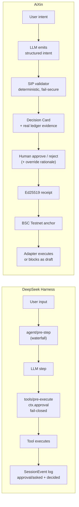

# AiXin vs DeepSeek Harness — Agent Framework Comparison

**Reviewed:** 21 August 2026 · **Subject:** [`deepseek-ai/deepseek-harness`](https://github.com/deepseek-ai/deepseek-harness) (MIT, developer preview)
**Scope:** agent runtime and framework only — not the AiXin product surface as a whole.

English | [中文](#中文版)

---

## 1. Why this document exists

DeepSeek Harness (`dsh`) is the most serious open-source agent *harness* published to date, and it is the closest external reference point to AiXin's runtime. Investors, partners and engineers keep asking a fair question: **"Is AiXin just another agent harness?"**

This document answers it honestly. It explains what `dsh` actually is and how it is built, describes AiXin's agent framework strictly as implemented in this codebase (every claim cites the file that implements it), puts the two side by side, and names the four things we should borrow.

Short answer up front: they solve different problems. `dsh` optimises for **runtime composability** — everything, including the agent loop, is a replaceable plugin. AiXin optimises for **third-party-verifiable governance** — the thing `dsh` treats as one well-designed plugin (approval) is our entire product thesis.

---

## 2. What DeepSeek Harness is

- An **agent harness** from DeepSeek AI: the runtime *around* a model — turn loop, tool registry, session log, sandbox, approvals, and user interfaces.
- **Not** a model, and **not** an application. You bring the model; `dsh` runs the loop.
- TypeScript pnpm monorepo (~9,000 files) with `apps/`, `packages/`, `native/`, `python/`, `website/`; over 50 packages under `packages/`.
- MIT licensed, explicitly in **developer preview** — the README warns of compatibility-breaking changes.
- Run it with `npx @deepseek-ai/dsh web` (Web UI on `127.0.0.1:3080`), or headless, TUI, or over ACP from an editor.
- Design thesis, stated in the README: **"Everything is a Plugin."**

---

## 3. `dsh` architecture

### 3.1 Cordis — the plugin substrate

`dsh` is powered by [Cordis](https://github.com/cordiverse/cordis). Plugins contribute three things to a shared context object (`ctx`):

1. **Services** — named capabilities mounted at `ctx.<key>`.
2. **Typed events** — the extension points.
3. **Reversible effects** — every registration unwinds automatically when its plugin unloads.

From `docs/architecture.md`:

> "There is no privileged core to patch: you extend dsh by mounting a plugin beside the others."

The model adapter, the tool registry, the session log, and **the agent loop itself** are all plugins. Any of them can be replaced from configuration without forking.

### 3.2 Boot composition — profiles, bundles, patches

A running `dsh` is a plugin tree composed at boot from ordered layers:

| Concept | Meaning |
|---|---|
| **Profile** | Named composition stored in the Harness home; lists the bundles it stacks, holds out-of-tree plugins and the user's `cordis.patch.yml`. `web` and `headless` ship as templates. |
| **Bundle** | Distribution format for Cordis config rows plus the code they mount, so anything it inserts stays patchable by layers above. |
| **Patch** | Targets a config row by id and replaces its whole config, or inserts new rows. |

Layer order: each bundle in the profile's order → the profile's `cordis.patch.yml` → the home-level one → any `--patch` overlay. `dsh-base` is always first (model adapters, tools, persistence, sandbox, approval policy, settings, credentials, telemetry); `dsh-web-app` adds the browser application; `dsh-headless` adds a one-shot runner with no server.

`dsh --profile web --dump-config` prints the exact tree the machine boots. Every row it prints is replaceable.

### 3.3 Core services

| Package | Owns | `ctx` key |
|---|---|---|
| `core/session` | Append-only `SessionEvent` log and in-memory store | `ctx.sessions` |
| `core/system-prompt` | Prompt-section and tool-schema assembly | `ctx.systemPrompt` |
| `core/tools` | Scoped tool registry and guarded execution pipeline | `ctx.tools` |
| `core/agent` | The `Agent` interface, live registry, `agent/*` events | `ctx.agents` |
| `core/agent-loop` | The default driver implementing that interface | `ctx.agentLoop` |
| `core/scope` | Per-agent scoped-registration primitive | (library) |
| `llm/llm` | Message/stream vocabulary plus the model adapter seam | `ctx.llm` |

### 3.4 The turn/step loop

A **step** is one model request plus the tools it calls. A **turn** is zero or more steps: it opens before its first input is claimed and closes once nothing is owed.

```text
turn/start
  claim next-step input plus one queued message
  assemble prompt sections + tool schemas
  -> agent/pre-step                   reject | enter(messages)
     reject, or a first enter rewritten empty -> close the turn with no step
     step/start
     append entered messages as user/message
     derive model history from the log
     agent/request -> llm/stream -> assistant/chunk* -> assistant/message
     tool/call* -> tools/pre-execute -> tools/execute -> tools/post-execute -> tool/result*
     step/end
     tools owe another request, or next-step input arrived -> claim -> next step
  -> agent/turn-stopping
turn/end
```

The critical design detail: `agent/pre-step`, `agent/request`, `llm/stream` and the three `tools/*` events are **waterfalls** — listeners must call `next()` to delegate. That is how you intercept, rewrite, gate or reject work *without forking the loop*. A rejected or empty first claim still closes a durable turn that spent no step, so the log records the attempt.

### 3.5 The invariant: "model-visible means logged"

The session log is the source of the context the model sees. `deriveMessages()` projects model history from it; raw `assistant/chunk` events preserve replay and UI fidelity.

> "Anything that reaches a model request must be reconstructable from the log, and a runtime invariant asserts it."

This single rule is what makes fork, resume, transcripts, compaction, telemetry and persistence all fall out of one stream. A new model-visible input *requires* a new session event — you cannot smuggle context into a prompt.

### 3.6 Capability seams

A **seam** is a swappable capability with three roles: a **Service Definition** (the interface), a **Service Provider** (an implementation), and a **Consumer** (usually a model-facing tool). One role alone is not a seam; adding a capability means designing all three.

Why it matters: filesystem and subprocess providers share one execution world, so pointing them at a remote sandbox (e2b) moves Bash, PTY **and** LSP with them — no provider forks. Subagent providers vary just as widely behind one interface, from a fresh child agent to a delegated turn in another product.

### 3.7 Governance-adjacent subsystems

**User approval** (`dsh-user-approval`, `ctx.approval`) is the closest analogue to AiXin's SIP, and it is well built:

- `approval/request` is an **answerer waterfall**; UI channels supply human answerers, the ACP bridge supplies one-shot machine decisions.
- `ApprovalOutcome` is **closed and fail-closed**: `allowed-once | rejected | cancelled | unavailable`. A missing, non-owning, throwing or non-conforming answerer resolves to `unavailable` — deny — rather than opening the gate. `allowed-once` grants only the asked-about action.
- Per-session `ApprovalPolicy` is `ask` or `never`; `never` deterministically rejects without dispatching anyone (the strict headless/CI stance). The effective value is the **last `approval/policy` event in the session log**, so replay reconstructs the override.
- Audit is a **log-only pair**: `approval/asked` + `approval/decided`, joined by a branded `ApprovalRequestId`. The request deliberately omits tool arguments and links to the already-streamed call by `callId` so no second copy can drift.

**Plan mode** (`dsh-plan-mode`) is explicitly labelled **soft guidance**: while active it injects a `plan:policy` prompt section and registers `exit_plan_mode`. Sandbox mode and approval policy enforce restrictions *independently* — plan mode never reads or writes them.

Also present: sandbox mode (Landlock and friends), skills, todo, goal, compaction, credentials, LSP, terminals, scheduling, jobs, and an experimental **Agent Teams** seam (`ctx.agentTeams`) with a durable roster, task board and mailbox layered over continuable subagents.

---

## 4. AiXin's agent framework, as actually built

Described from the code in this repository, not aspirationally.

### 4.1 The loop

`src/routes/api/chat.ts` — Vercel AI SDK `streamText` with `stopWhen: stepCountIs(50)`. The loop is a library we consume, not a component we own. Conversation is persisted to `chat_messages` (idempotent upsert on `(user_id, message_id)`).

### 4.2 Tools

A fixed Zod `tool()` catalogue defined inline per request: `list_specialists`, `search_marketplace`, `delegate_to_specialist`, and siblings. Every tool closes over the RLS-scoped Supabase client, so tool reach is bounded by the caller's row-level permissions. There is no registry and no per-agent scoping — the catalogue is a literal object.

### 4.3 Model seam

`src/lib/ai-gateway.server.ts` → `resolveChatModel(role, runId, pinnedModelId)`:

- **Hosted** — Lovable AI Gateway via `@ai-sdk/openai-compatible`, with run-id propagation for tracing.
- **Self-hosted** — any OpenAI-compatible endpoint via `AIXIN_LLM_BASE_URL` (local Ollama running Qwen, DashScope, DeepSeek), for China-friendly deployment.
- Organisations can **pin** an approved model id as a compliance requirement.

This is a genuine adapter seam, functionally equivalent in intent to `ctx.llm` — just configured by environment rather than composed as a plugin.

### 4.4 The governance kernel — where AiXin's real work is

| Stage | Implementation |
|---|---|
| Intent emission | LLM proposes a structured intent via `delegate_to_specialist` |
| **Deterministic validation** | `src/lib/sip.server.ts` — 6 rules (schema, known action, amount cap `< 10,000`, ISO currency, params shape, **no extraneous fields**), fail-secure. No LLM call. Any unknown field, missing field or rule violation → high risk |
| Risk tiering | High-risk action set (`book_flight`, `book_hotel`, `execute_trade`, `issue_refund`, `publish_post`) or any monetary amount → `requires_approval` |
| Human decision | Decision Card at `/dashboard/governance` and in `/dashboard/ask`, seeded with **real ledger evidence** via `src/lib/refund-evidence.server.ts` — the human sees the customer, the order, and prior refunds, not just a JSON blob |
| Symmetric audit | `src/lib/sip.functions.ts` — **rejections are signed too**; approving against a "reject" recommendation demands an override rationale, which is captured and anchored |
| Cryptographic receipt | `src/lib/receipt-signer.server.ts` — Ed25519 signature over the payload hash; public key published for third-party verification |
| On-chain anchor | `src/lib/anchor.server.ts` → BSC Testnet, with an explicit failure state and a retry queue — **no silent fallback** |
| Public verification | `/api/public/verify/$sipId` and `/verify/$sipId` — anyone can check a receipt without an AiXin account |
| Identity | `src/lib/erc8004.server.ts` — ERC-8004 on-chain identity for Twins |

### 4.5 The durable trace

`task_events` (ordered `seq`, `phase` ∈ act/verify/anchor/gate, `kind` ∈ tool/sip/model/guard/output/loop/chain), plus `task_messages`, `task_outcomes`, and `delivery_logs`. Written by `src/lib/execution.server.ts`. Replayable in the UI and mirrored to Telegram/WeChat.

Important caveat, stated plainly: this trace is **observability**, not the canonical source the prompt is derived from. We do not yet have `dsh`'s "model-visible means logged" invariant. See §7.2.

### 4.6 Execution honesty

`src/lib/execution-capability.ts` — a rule that most agent frameworks do not have:

> An AI-written artifact is never a success path. If no live tool ran, the task halts with `status: "blocked"`, `reason: "no_live_adapter"`, and the artifact is labelled **"Draft — not executed" / "草稿（未执行）"**.

Artifacts carry machine-readable markers (`_executed: false`, `_status: "draft_not_executed"`) so the UI, the API and the Telegram/WeChat channels all tell the same truth. AiXin refuses to simulate execution.

### 4.7 Multi-agent and extensibility

- **Master Twin** ("AiXin") orchestrates **Specialist Twins** by A2A delegation, gated by SIP.
- **Skills** with `SKILL.md` manifests (`src/lib/skill-manifest.ts`), marketplace visibility, pricing, dev/live status, versioning, and install consent.
- **Adapters** — Telegram, Gmail (OAuth), signed Webhooks (HMAC-SHA256), WeChat, BSC — are the capability extension layer, with `delivery_logs` observability and a "Test connection" path.
- **Content safety and multi-tenancy** for partner apps: `src/lib/content-safety.server.ts` (hash-only audit logs), `src/lib/tenant-api.server.ts`, organizations/members.

---

## 5. Side by side

| Dimension | DeepSeek Harness | AiXin |
|---|---|---|
| **Loop** | Own driver plugin (`core/agent-loop`); turn/step with waterfall interceptors | Vercel AI SDK `streamText` + `stopWhen: stepCountIs(50)` (`src/routes/api/chat.ts`) |
| **Tool registry** | `ctx.tools` — scoped registry, schemas auto-join prompt assembly, guarded pipeline | Fixed Zod `tool()` literal per request; reach bounded by RLS |
| **Extensibility model** | Cordis plugins, bundles, profiles, config patches — *runtime* is replaceable | Skills + `SKILL.md` + Adapters — *capabilities* are extensible; runtime is fixed |
| **Multi-agent** | Subagent seam; experimental Agent Teams (roster, task board, mailbox) | First-class product concept: Master Twin → Specialist Twins via A2A |
| **Approval** | `ctx.approval`, answerer waterfall, fail-closed `allowed-once/rejected/cancelled/unavailable`, `ask`/`never`, log-only `asked`+`decided` pair | **SIP**: deterministic 6-rule validator → evidence-rich Decision Card → human decision → Ed25519 receipt → BSC anchor; signed rejections; override rationale |
| **Event log** | `SessionEvent` append-only; **"model-visible means logged"** invariant enforced at runtime; fork/resume/compaction derive from it | `task_events`/`task_messages`/`task_outcomes`/`delivery_logs` in Postgres; durable and replayable, but not the prompt's canonical source |
| **Execution honesty** | Sandbox + approval enforce; plan mode is explicitly soft | `execution-capability.ts` — no live adapter ⇒ `blocked` + "draft, not executed"; simulation refused |
| **Verifiability** | In-process audit; trust the harness operator | Third-party verifiable — signed receipts, published public key, on-chain anchor, ERC-8004 identity, public `/verify/:sipId` |
| **Surfaces** | Web, TUI, headless one-shot, ACP editor bridge — one core | Web dashboard, Telegram, WeChat, tenant API |
| **Model layer** | `ctx.llm` adapter seam (plugin) | `resolveChatModel()` — hosted gateway or self-hosted Qwen/Ollama; pinnable model id |
| **Sandboxing** | Landlock, e2b remote sandbox, filesystem/subprocess provider swap | Not a sandbox story — adapters are the blast-radius boundary, plus RLS and content safety |
| **Licence / maturity** | MIT, developer preview, breaking changes expected | Proprietary product; testnet go-live track |

### Pipeline comparison



---

## 6. The honest difference

**`dsh` is a harness framework.** Its value is that every layer — model adapter, tool registry, session store, sandbox, subagent provider, even the loop — is swappable from configuration. Approval is one very well-designed plugin among dozens. Its audit is **fail-closed and auditable in-process**: excellent, provided you trust the operator running the harness.

**AiXin is an agent product with a governance kernel.** Our differentiator is precisely the plugin `dsh` treats as one seam: deterministic pre-execution validation, evidence-rich human Decision Cards, symmetric signing of approvals *and* rejections, cryptographic receipts, on-chain anchoring, and a refusal to fake execution. Our audit is **fail-secure and auditable to a third party who trusts neither the model nor us**.

Neither position is strictly better; they are different products. But the comparison sharpens our claim: *we are not competing on harness composability, and we should stop implying we are*. AiXin's answer to "why not just use `dsh`?" is: because `dsh` will faithfully execute a wrong action with a clean in-process audit trail, and nobody outside your organisation can check that trail afterwards.

---

## 7. What we should borrow

Analysis only — no code changes accompany this document. Each item names the concrete AiXin change it implies.

### 7.1 A dynamic, per-agent tool registry
Replace the hard-coded `tool()` literal in `src/routes/api/chat.ts` with a registry that installed **Skills** and connected **Adapters** register into, scoped per Twin. Today a new Skill cannot give the Master Twin a new model-facing tool without a code change — which undercuts the whole marketplace story. `dsh`'s `core/tools` + `core/scope` is the reference design.

### 7.2 A "model-visible means logged" invariant
Derive prompts from `task_events` / `task_messages` rather than assembling them ad hoc, and assert at runtime that nothing reaches a model request that is not reconstructable from the trace. For a company whose product is *trust*, "the transcript is provably complete" is a headline feature, not a refactor. It also gives us fork, resume and compaction for free.

### 7.3 Waterfall-style interceptors around the loop
Today SIP is invoked inside individual tool bodies (`delegate_to_specialist`). A pre-step / pre-execute interceptor seam would let SIP gate **every** tool uniformly, so a newly registered Skill tool cannot accidentally bypass governance. This is the single highest-value structural borrow — it converts governance from a convention into an invariant.

### 7.4 A real subagent seam
Specialist Twins are currently delegation *records* rather than child agents. Giving them their own tool scope, their own session sub-log and their own approval context would make the "team of twins" architecture real, and it maps cleanly onto `dsh`'s subagent seam and Agent Teams roster/task-board/mailbox pattern.

These four can be promoted to a roadmap phase (proposed name: *Phase 4 — Governed Agent Runtime*) when we choose to schedule them.

---

## 8. Sources

- Repository: <https://github.com/deepseek-ai/deepseek-harness> (commit at `HEAD`, reviewed 21 August 2026)
- `README.md`, `docs/architecture.md`, `docs/agent-lifecycle.md`
- `docs/subsystems/approval.md`, `docs/subsystems/plan.md`, `docs/subsystems/agent-team.md`, `docs/subsystems/core.md`
- `docs/capability-seams.md`, `docs/event-producer-consumer.md`, package tree under `packages/`
- Cordis: <https://github.com/cordiverse/cordis> — *A Programming Paradigm for Spatiotemporal Composability*
- AiXin: `src/routes/api/chat.ts`, `src/lib/sip.server.ts`, `src/lib/sip.functions.ts`, `src/lib/ai-gateway.server.ts`, `src/lib/execution.server.ts`, `src/lib/execution-capability.ts`, `src/lib/receipt-signer.server.ts`, `src/lib/anchor.server.ts`, `src/lib/refund-evidence.server.ts`, `src/lib/skill-manifest.ts`

---

<a id="中文版"></a>

# 中文版：AiXin 与 DeepSeek Harness 智能体框架对比

**审阅日期：** 2026 年 8 月 21 日 · **对象：** [`deepseek-ai/deepseek-harness`](https://github.com/deepseek-ai/deepseek-harness)（MIT，开发者预览版）
**范围：** 仅限智能体运行时与框架，不涉及 AiXin 产品的全部内容。

## 一、为什么要写这份文档

DeepSeek Harness（`dsh`）是目前公开的最严肃的开源智能体**运行框架（harness）**，也是与 AiXin 运行时最接近的外部参照。投资人、合作伙伴和工程师反复提出一个合理的问题：**"AiXin 是不是又一个智能体框架？"**

本文如实作答。它说明 `dsh` 到底是什么、如何构建；严格依据本代码库中已实现的代码描述 AiXin 的智能体框架（每一条论断都标注实现文件）；将两者并列对比；并指出我们应当借鉴的四点。

结论先行：两者解决的问题不同。`dsh` 追求**运行时可组合性**——包括智能体主循环在内的一切都是可替换插件。AiXin 追求**可被第三方验证的治理能力**——`dsh` 视为一个优秀插件的"审批"，恰恰是我们全部的产品命题。

## 二、DeepSeek Harness 是什么

- DeepSeek AI 推出的**智能体运行框架**：围绕模型的运行时——回合循环、工具注册表、会话日志、沙箱、审批与多种用户界面。
- 它**不是**模型，也**不是**应用。模型由你提供，`dsh` 负责跑循环。
- TypeScript pnpm 单体仓库（约 9,000 个文件），`packages/` 下超过 50 个包。
- MIT 许可，明确处于**开发者预览**阶段，README 声明会有破坏性变更。
- 运行方式：`npx @deepseek-ai/dsh web`（Web UI 默认 `127.0.0.1:3080`），也支持无头模式、终端 UI，或通过 ACP 从编辑器接入。
- 设计主张（README 原文）：**"一切皆插件"**。

## 三、`dsh` 的架构

### 3.1 Cordis —— 插件基座

`dsh` 基于 [Cordis](https://github.com/cordiverse/cordis)。插件向共享上下文对象 `ctx` 贡献三类内容：**服务**（挂载于 `ctx.<key>`）、**类型化事件**（扩展点）、**可逆副作用**（插件卸载时自动回滚所有注册）。

文档原文：**"没有需要打补丁的特权内核：扩展 dsh 的方式是在其他插件旁边再挂载一个插件。"** 模型适配器、工具注册表、会话日志，乃至**智能体主循环本身**，全都是插件，均可通过配置替换而无需 fork。

### 3.2 启动组合 —— profile、bundle 与 patch

| 概念 | 含义 |
|---|---|
| **Profile（配置档）** | 存放于 Harness 主目录的具名组合，列出所堆叠的 bundle，并保存用户自己的 `cordis.patch.yml`。内置 `web` 与 `headless` 模板。 |
| **Bundle（分发包）** | Cordis 配置行及其代码的分发格式，其插入的内容仍可被上层图层打补丁。 |
| **Patch（补丁）** | 按 id 定位配置行并整体替换其配置，或插入新行。 |

叠加顺序：profile 内各 bundle → profile 的 `cordis.patch.yml` → 主目录级 → `--patch` 覆盖层。`dsh-base` 永远是第一层（模型适配器、工具、持久化、沙箱、审批策略、设置、凭据、遥测）。`dsh --profile web --dump-config` 可打印本机实际启动的完整插件树，其中任意一行都可替换。

### 3.3 核心服务

| 包 | 职责 | `ctx` 键 |
|---|---|---|
| `core/session` | 只追加的 `SessionEvent` 日志与内存存储 | `ctx.sessions` |
| `core/system-prompt` | 提示词分段与工具 schema 组装 | `ctx.systemPrompt` |
| `core/tools` | 带作用域的工具注册表与受控执行流水线 | `ctx.tools` |
| `core/agent` | `Agent` 接口、活跃注册表、`agent/*` 事件 | `ctx.agents` |
| `core/agent-loop` | 实现该接口的默认驱动器 | `ctx.agentLoop` |
| `llm/llm` | 消息/流式词汇表与模型适配器接缝 | `ctx.llm` |

### 3.4 回合与步骤循环

一个**步骤（step）**＝一次模型请求加上它调用的工具；一个**回合（turn）**＝零个或多个步骤。

```text
turn/start
  认领下一步输入与一条排队消息
  组装提示词分段 + 工具 schema
  -> agent/pre-step                   可拒绝 | enter(messages)
     被拒绝，或首次 enter 被改写为空 -> 关闭回合且不消耗步骤
     step/start
     将进入的消息追加为 user/message
     从日志派生模型历史
     agent/request -> llm/stream -> assistant/chunk* -> assistant/message
     tool/call* -> tools/pre-execute -> tools/execute -> tools/post-execute -> tool/result*
     step/end
     若工具还需一次请求，或新输入到达 -> 认领 -> 下一步
  -> agent/turn-stopping
turn/end
```

关键设计：`agent/pre-step`、`agent/request`、`llm/stream` 与三个 `tools/*` 事件都是**瀑布式（waterfall）**——监听器必须调用 `next()` 才会向下委派。这就是**无需 fork 主循环**即可拦截、改写、把关或拒绝工作的机制。即使首次认领被拒，也仍会关闭一个"未消耗步骤"的持久回合，日志因此保留了这次尝试记录。

### 3.5 不变式："模型可见即已记录"

会话日志是模型所见上下文的唯一来源，`deriveMessages()` 从中投影出模型历史。文档原文：**"任何进入模型请求的内容都必须能够从日志中重建，并由运行时不变式加以断言。"**

正是这一条规则，让 fork、恢复、转录、压缩、遥测与持久化全部从同一条事件流中自然导出。新增模型可见输入**必须**新增会话事件——无法把上下文偷偷塞进提示词。

### 3.6 能力接缝（capability seams）

一个**接缝**由三个角色构成：**服务定义**（接口）、**服务提供方**（实现）、**消费方**（通常是面向模型的工具）。只有其中一个角色不构成接缝；新增能力意味着三者都要设计。

价值所在：文件系统与子进程提供方共享同一个执行世界，因此把它们指向远程沙箱（e2b），Bash、PTY **与** LSP 会一并迁移，无需分叉任何提供方。子智能体提供方同样在单一接口之后千变万化。

### 3.7 与治理相关的子系统

**用户审批**（`dsh-user-approval`，`ctx.approval`）是与 AiXin SIP 最接近的对应物，设计相当扎实：

- `approval/request` 是**应答者瀑布链**；UI 通道提供人工应答者，ACP 桥提供一次性机器判定。
- `ApprovalOutcome` 是**封闭且失败即拒绝**的：`allowed-once | rejected | cancelled | unavailable`。缺失、不归属、抛错或不符合约定的应答者一律解析为 `unavailable`（拒绝），绝不放行。`allowed-once` 仅授权被询问的那一次动作。
- 会话级 `ApprovalPolicy` 为 `ask` 或 `never`；`never` 不派发任何应答者、确定性地拒绝（适用于 CI 等严格无人值守场景）。生效值取自**会话日志中最后一条 `approval/policy` 事件**，因此重放可重建覆盖状态。
- 审计为**仅日志的成对事件**：`approval/asked` + `approval/decided`，由带品牌类型的 `ApprovalRequestId` 关联。请求刻意不携带工具参数，而通过 `callId` 关联已推流的调用，避免出现第二份可能漂移的副本。

**计划模式**（`dsh-plan-mode`）被明确标注为**软性引导**：激活时注入 `plan:policy` 提示词分段并注册 `exit_plan_mode`。沙箱模式与审批策略**独立**实施限制，计划模式既不读也不写它们。

此外还有沙箱模式（Landlock 等）、技能、待办、目标、上下文压缩、凭据、LSP、终端、调度、任务，以及实验性的**智能体团队**接缝（`ctx.agentTeams`，包含持久花名册、任务板与信箱）。

## 四、AiXin 的智能体框架（按实际代码）

### 4.1 主循环
`src/routes/api/chat.ts` —— Vercel AI SDK `streamText`，`stopWhen: stepCountIs(50)`。主循环是我们所使用的库，而非我们拥有的组件。对话持久化到 `chat_messages`（按 `(user_id, message_id)` 幂等 upsert）。

### 4.2 工具
每次请求内联定义的固定 Zod `tool()` 目录：`list_specialists`、`search_marketplace`、`delegate_to_specialist` 等。每个工具都闭包了受 RLS 约束的 Supabase 客户端，因此工具的可及范围由调用者的行级权限限定。目前没有注册表，也没有按智能体划分的作用域——目录就是一个字面量对象。

### 4.3 模型接缝
`src/lib/ai-gateway.server.ts` → `resolveChatModel()`：**托管**（Lovable AI 网关，带 run-id 追踪）或**自托管**（通过 `AIXIN_LLM_BASE_URL` 接任意 OpenAI 兼容端点，如本地 Ollama 运行的 Qwen、DashScope、DeepSeek），面向中国境内部署。企业可**锁定**经审批的模型 id 以满足合规要求。这是一个真实的适配器接缝，意图上等同于 `ctx.llm`，只是通过环境变量而非插件组合来配置。

### 4.4 治理内核 —— AiXin 真正的工作所在

| 阶段 | 实现 |
|---|---|
| 意图产生 | LLM 通过 `delegate_to_specialist` 提出结构化意图 |
| **确定性校验** | `src/lib/sip.server.ts` —— 6 条规则（schema、已知动作、金额上限 `< 10,000`、ISO 货币码、params 结构、**禁止多余字段**），失败即从严。此处不调用 LLM。任何未知字段、缺失字段或违规均判为高风险 |
| 风险分级 | 命中高风险动作集合（`book_flight`、`book_hotel`、`execute_trade`、`issue_refund`、`publish_post`）或涉及金额 → `requires_approval` |
| 人工决策 | `/dashboard/governance` 与 `/dashboard/ask` 中的决策卡，由 `src/lib/refund-evidence.server.ts` 注入**真实台账证据**——人看到的是客户、订单与既往退款记录，而不是一团 JSON |
| 对称审计 | `src/lib/sip.functions.ts` —— **拒绝同样会被签名**；若人工在系统建议"拒绝"时选择批准，则必须填写覆盖理由，该理由会被记录并上链 |
| 加密回执 | `src/lib/receipt-signer.server.ts` —— 对载荷哈希做 Ed25519 签名；公钥公开，供第三方验证 |
| 链上锚定 | `src/lib/anchor.server.ts` → BSC 测试网，具备显式失败状态与重试队列——**没有静默兜底** |
| 公开验证 | `/api/public/verify/$sipId` 与 `/verify/$sipId`——无需 AiXin 账号即可核验回执 |
| 身份 | `src/lib/erc8004.server.ts` —— 双生体的 ERC-8004 链上身份 |

### 4.5 持久化轨迹
`task_events`（有序 `seq`、`phase` ∈ act/verify/anchor/gate、`kind` ∈ tool/sip/model/guard/output/loop/chain），以及 `task_messages`、`task_outcomes`、`delivery_logs`，由 `src/lib/execution.server.ts` 写入，可在 UI 重放并镜像到 Telegram/微信。

必须如实指出：该轨迹属于**可观测性**，尚不是提示词的规范来源。我们目前**没有** `dsh` 的"模型可见即已记录"不变式。参见 7.2。

### 4.6 执行诚实性
`src/lib/execution-capability.ts` —— 多数智能体框架并不具备的一条规则：

> AI 撰写的产物永远不算成功路径。若没有真实工具执行，任务以 `status: "blocked"`、`reason: "no_live_adapter"` 中止，产物标注为**"草稿（未执行）"**。

产物携带机器可读标记（`_executed: false`、`_status: "draft_not_executed"`），使 UI、API 与 Telegram/微信通道口径一致。AiXin 拒绝模拟执行。

### 4.7 多智能体与可扩展性
- **主双生体**（AiXin）通过 A2A 委派编排**专家双生体**，全程受 SIP 把关。
- **技能**：`SKILL.md` 清单（`src/lib/skill-manifest.ts`）、市场可见性、定价、开发/上线状态、版本管理与安装授权。
- **外部工具连接**：Telegram、Gmail（OAuth）、签名 Webhook（HMAC-SHA256）、微信、BSC，配套 `delivery_logs` 可观测性与"测试连接"。
- **内容安全与多租户**：`src/lib/content-safety.server.ts`（仅哈希的审计日志）、`src/lib/tenant-api.server.ts`、组织/成员表。

## 五、并列对比

| 维度 | DeepSeek Harness | AiXin |
|---|---|---|
| **主循环** | 自有驱动插件（`core/agent-loop`），回合/步骤 + 瀑布式拦截 | Vercel AI SDK `streamText` + `stepCountIs(50)` |
| **工具注册** | `ctx.tools`：带作用域的注册表，schema 自动并入提示词组装，受控流水线 | 每请求固定 Zod `tool()` 字面量；范围由 RLS 限定 |
| **扩展模型** | Cordis 插件、bundle、profile、配置补丁——**运行时**可替换 | 技能 + `SKILL.md` + 外部工具连接——**能力**可扩展，运行时固定 |
| **多智能体** | 子智能体接缝；实验性智能体团队 | 产品一等概念：主双生体 → 专家双生体（A2A） |
| **审批** | `ctx.approval`、应答者瀑布链、失败即拒绝的封闭结果、`ask`/`never`、`asked`+`decided` 日志对 | **SIP**：确定性 6 规则校验 → 带证据的决策卡 → 人工决策 → Ed25519 回执 → 链上锚定；拒绝亦签名；覆盖需理由 |
| **事件日志** | `SessionEvent` 只追加；运行时强制**"模型可见即已记录"**；fork/恢复/压缩由其导出 | Postgres 中的 `task_events` 等；持久可重放，但不是提示词的规范来源 |
| **执行诚实性** | 由沙箱与审批强制；计划模式明确为软性 | 无实时连接即 `blocked` + "草稿（未执行）"；拒绝模拟 |
| **可验证性** | 进程内审计，需信任运行方 | 第三方可验证：签名回执、公开公钥、链上锚定、ERC-8004、公开 `/verify/:sipId` |
| **接入面** | Web、终端 UI、无头、ACP 编辑器桥——共用同一内核 | Web 控制台、Telegram、微信、租户 API |
| **模型层** | `ctx.llm` 适配器接缝（插件） | `resolveChatModel()`：托管网关或自托管 Qwen/Ollama，可锁定模型 |
| **沙箱** | Landlock、e2b 远程沙箱、文件系统/子进程提供方切换 | 非沙箱路线：以外部工具连接为爆炸半径边界，辅以 RLS 与内容安全 |
| **许可 / 成熟度** | MIT，开发者预览，预期破坏性变更 | 商业产品；测试网上线阶段 |

## 六、真实差异

**`dsh` 是运行框架。** 其价值在于每一层——模型适配器、工具注册表、会话存储、沙箱、子智能体提供方，乃至主循环——都能通过配置替换。审批只是其中一个设计精良的插件。它的审计是**失败即拒绝、进程内可审计**的：只要你信任运行该框架的一方，这非常出色。

**AiXin 是带治理内核的智能体产品。** 我们的差异点恰恰是 `dsh` 当作一个接缝处理的部分：执行前的确定性校验、带真实证据的人工决策卡、批准与拒绝的对称签名、加密回执、链上锚定，以及拒绝伪造执行。我们的审计是**失败即从严、且可被既不信任模型也不信任我们的第三方验证**。

两种定位并无绝对优劣，但对比让我们的主张更锋利：*我们并不在"框架可组合性"这条赛道上竞争，也不应再暗示如此。* 对"为什么不直接用 `dsh`？"的回答是：因为 `dsh` 会忠实地执行一个错误动作，并留下一份干净的进程内审计记录，而组织之外没有任何人能事后核验这份记录。

## 七、我们应当借鉴什么

仅为分析，本文不附带任何代码变更。

**7.1 动态的、按智能体划分的工具注册表** —— 用注册表取代 `src/routes/api/chat.ts` 中硬编码的 `tool()` 字面量，让已安装的**技能**与已连接的**外部工具连接**按双生体作用域注册进来。如今新增技能无法在不改代码的前提下为主双生体带来新的模型可见工具，这削弱了整个市场叙事。参考 `dsh` 的 `core/tools` + `core/scope`。

**7.2 "模型可见即已记录"不变式** —— 从 `task_events` / `task_messages` 派生提示词，并在运行时断言：任何进入模型请求的内容都可由轨迹重建。对一家以"信任"为产品的公司而言，"转录记录可证完整"是头条特性而非重构杂务，同时还免费带来 fork、恢复与上下文压缩。

**7.3 瀑布式循环拦截器** —— 目前 SIP 内嵌在单个工具实现里（`delegate_to_specialist`）。引入 pre-step / pre-execute 拦截接缝后，SIP 可统一为**所有**工具把关，新注册的技能工具便无法意外绕过治理。这是价值最高的一处结构性借鉴——它把治理从约定升级为不变式。

**7.4 真正的子智能体接缝** —— 专家双生体目前只是委派**记录**，而非子智能体。赋予其独立的工具作用域、独立的会话子日志与独立的审批上下文，"双生体团队"架构才真正成立，并可直接对应 `dsh` 的子智能体接缝与智能体团队（花名册/任务板/信箱）模式。

上述四项可在排期时提升为一个路线图阶段（建议命名：*阶段 4 —— 受治理的智能体运行时*）。

## 八、资料来源

- 仓库：<https://github.com/deepseek-ai/deepseek-harness>（`HEAD`，2026 年 8 月 21 日审阅）
- `README.md`、`docs/architecture.md`、`docs/agent-lifecycle.md`、`docs/subsystems/{approval,plan,agent-team,core}.md`、`docs/capability-seams.md`
- Cordis：<https://github.com/cordiverse/cordis>
- AiXin：`src/routes/api/chat.ts`、`src/lib/sip.server.ts`、`src/lib/sip.functions.ts`、`src/lib/ai-gateway.server.ts`、`src/lib/execution.server.ts`、`src/lib/execution-capability.ts`、`src/lib/receipt-signer.server.ts`、`src/lib/anchor.server.ts`、`src/lib/refund-evidence.server.ts`、`src/lib/skill-manifest.ts`
