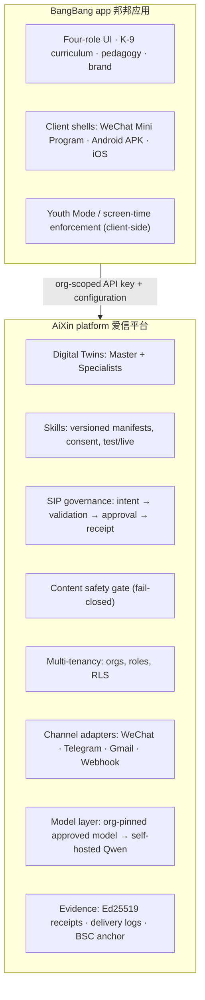
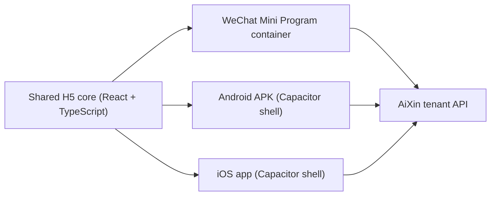
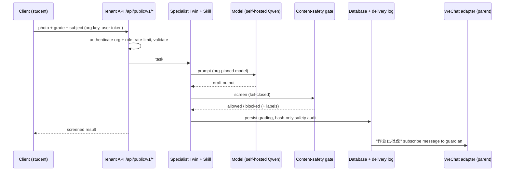
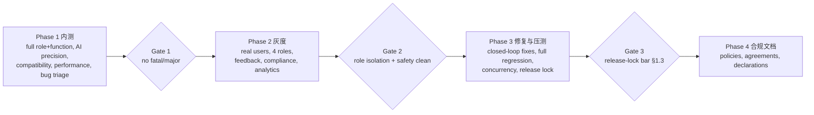

# BangBang App — Product Requirements Document (PRD)
# 邦邦 App 产品需求文档（含架构与设计）

Version 1.0 · 2026-08-20 · Owner: AiXin team · Audience: BangBang management (business) + AiXin/BangBang engineering
Companion document: `BANGBANG_ON_AIXIN.md` (why BangBang is *built on* AiXin, and who owns what)
Inputs: BangBang demo mockup (`BangBang_Demo_Script`), BangBangKH *Workflow and Content for APP Trial Version Development Testing* (2026-08-15), WeChat group request of 2026-08-20

---

## 0. Executive summary / 摘要

The demo mockup proved the concept and settled the UI language. It is a **script**, not a product: nothing
persists, no role is really isolated, no AI answer is really screened. BangBang management has asked for a
**complete, installable trial version** that real students, parents, teachers and institution staff can use.

This PRD specifies that trial version end to end: product scope, four-role model, every AI module, the
architecture on the AiXin platform, the compliance envelope required for a K–9 education app in China, and a
test plan mapped 1:1 onto BangBang's own four testing phases.

Three commitments frame everything below.

| Commitment | What it means | Why |
| --- | --- | --- |
| **One core, two shells** | A single H5/React application core, delivered as a WeChat Mini Program *and* as an installable Android/iOS package | Mini Program reaches parents instantly; the install package is what their document requires (安装包, device compatibility, 青少年模式) |
| **Staged trial builds P0 → P1 → P2** | Every AI module in their document is specified here; they ship in three testable builds rather than one big-bang release | A real, testable app in weeks beats a complete app in quarters — and their Phase 1 needs something to test |
| **Nothing unscreened reaches a child** | Every AI output passes the AiXin content-safety gate, fail-closed, before it leaves the server | Non-negotiable for minors, and the basis of the 内容安全 filing |

**What is honestly not solved yet** (detailed in §9): a licensed domestic content-safety vendor contract, queued
GPU serving sized for classroom concurrency, and the ICP / 算法备案 / AI 内容安全备案 filings. These are gating
items for public launch, not for internal trial.

---

## 1. Goals, non-goals, success criteria / 目标与验收

### 1.1 Goals

1. Turn the mockup into a real application with persistent data, real accounts, and enforced role isolation.
2. Deliver every AI capability listed in BangBang's 2026-08-15 document, staged P0/P1/P2.
3. Satisfy BangBang's Phase 1–4 test scope so the build can be handed to grayscale users without embarrassment.
4. Prove the AiXin platform thesis: BangBang's tutoring brains are AiXin Digital Twins + Skills, configured — not
   bespoke code.

### 1.2 Non-goals (for the trial version)

- Payment, subscription and billing flows (institution contracts remain offline for the trial).
- Public marketplace of third-party tutors or content.
- Cross-institution data sharing or league tables.
- Mainland public launch before the filings in §9 close.

### 1.3 Success criteria — the release-lock bar

Taken from BangBang's Phase 3.4 ("版本优化与发版锁定"). The build is accepted when **all** hold:

| # | Criterion | Measure |
| --- | --- | --- |
| 1 | Zero fatal bugs, zero major bugs | Bug tracker, verified-fixed and regression-passed |
| 2 | No high-frequency minor bugs | < 5 open minor bugs, none reproducible in > 10% of sessions |
| 3 | Role isolation holds | 100% of the permission test matrix (§8.2) passes; zero cross-role data leaks |
| 4 | AI quality | ≥ 95% grade-appropriate, ≥ 98% non-hallucinated on the golden set (§4.3) |
| 5 | Safety | 0 sensitive/harmful outputs escape the gate on the red-team set; gate fail-closed verified |
| 6 | Performance | Cold launch ≤ 3 s, AI first response ≤ 4 s (text) / ≤ 8 s (photo grading), memory ≤ 300 MB on a 2 GB Android device |
| 7 | Network resilience | No crash offline; friendly prompt shown; queued work resyncs on recovery |
| 8 | Concurrency | Stress targets in §8.5 met, with graceful "系统繁忙" backpressure rather than failure |
| 9 | Compliance docs | Privacy policy, user agreement, minors clause, permission usage, AI content declaration all final |

---

## 2. Users, roles and permissions / 四类角色

### 2.1 The four roles

| Role | Chinese | Who | Primary jobs |
| --- | --- | --- | --- |
| Student | 学生 | Grade 1–9 learner | Ask, photograph homework, practise, review mistakes, talk to the tutor |
| Parent | 家长 | Guardian of one or more students | Oversee progress, read reports, monitor emotional signals, set limits |
| Teacher | 教师 | Class teacher | See linked students, class statistics, learning analysis, override AI grading |
| Institution | 机构 | School/centre admin | Manage members and classes, answer parent enquiries, configure guidance keywords, route online → offline |

These map onto AiXin's existing `organization_members.role` values (`owner`, `admin`, `teacher`, `parent`,
`student`) — the platform already enforces them in the database, not in the UI.

### 2.2 Linking model / 关联关系

```text
institution (org)
   ├── class ──── teacher (many-to-many)
   │      └── enrolment ──── student
   └── guardianship: parent ──── student   (verified by invite code, teacher-confirmed)
```

- A parent sees a student only through a **verified guardianship** row.
- A teacher sees a student only through a **shared class enrolment**.
- An institution admin sees aggregates for its own org; individual emotional-analysis detail requires a
  documented purpose and is logged.
- Row-level security enforces all of the above; the platform helper `can_view_org_subject(viewer, org, subject)`
  is extended to cover class enrolment.

### 2.3 Permission matrix (extract)

| Resource | Student | Parent | Teacher | Institution |
| --- | --- | --- | --- | --- |
| Own submissions & gradings | CRUD own | Read linked | Read class | Aggregate only |
| Error notebook | CRUD own | Read linked | Read class | Aggregate only |
| Emotional log | Create (implicit) | Read linked, summarised | Read class-level alerts only | Alerts only |
| Student profile | Read own | Read linked | Read class | Aggregate only |
| Pathway report | Read own (age-gated) | Read + share | Contribute notes | Publish (SIP-governed) |
| Class analytics | — | — | Read own classes | Read all classes |
| Member management | — | — | Invite students to own class | Full |
| Guidance keywords | — | — | — | Configure (audited) |
| Screen-time policy | Read | Set for linked student | — | Set org default |

Full matrix lives in the test plan (§8.2) as executable cases.

### 2.4 Account lifecycle

Registration (phone + SMS code; WeChat one-tap inside the Mini Program) → role selection → verification
(student needs a guardian or class invite code) → login / logout / **role switching** for people who hold more
than one role (a teacher who is also a parent). Role switching re-issues scope; it never widens it client-side.

---

## 3. Screen inventory / 页面清单

Derived from the demo mockup and promoted to buildable specs. Every screen must define: loading, empty, error,
offline, and permission-denied states — the mockup has none of these, and their absence is the single largest
source of the "blank screen / freeze / redirect error" class of bug their document calls out.

### 3.1 Shared

Splash · onboarding & consent · register · login · forgot password · role select/switch · profile & settings ·
notifications · help & feedback · privacy policy · user agreement · AI content declaration · youth-mode gate.

### 3.2 Student

Home (今日任务 + quick actions) · Photo solve (camera → crop → recognise → explanation) · Homework grading ·
Ask/voice chat · Composition workshop (写作 → 润色 → 短视频) · English oral practice · Math practice generator +
PDF export · Error notebook (错题本, by subject/knowledge point/date) · Progress & profile · Screen-time status.

### 3.3 Parent

Home (children switcher) · Child progress · Weekly/monthly report · Emotional wellbeing panel · Error-review
digest · Usage & screen-time controls · Message the teacher/institution · Consent centre.

### 3.4 Teacher

Home (my classes) · Class roster · Class analytics (mastery heatmap, common errors) · Student detail ·
Grading review & override · Assignment push · Alerts inbox.

### 3.5 Institution

Dashboard (activity, adoption, alerts) · Members & classes · Parent enquiry queue · Guidance-keyword
configuration · Report publication (governed) · Compliance & audit view · Export.

---

## 4. AI capability catalogue / AI 能力清单

Every module from BangBang's document is specified. Delivery is staged so a testable build exists early.

### 4.1 Staging

| Stage | Modules | Target |
| --- | --- | --- |
| **P0** — trial build 1 | Photo problem recognition + error analysis; all-subject homework grading; math exercise generation + PDF export; error notebook; AI chat (text-first, voice input optional); student profile v1 | Internal testing (their Phase 1) |
| **P1** — trial build 2 | Chinese composition generation / polishing; English oral situational dialogue (ASR + scoring); psychological & emotional analysis + parent monitoring; class-level teacher analytics | Grayscale (their Phase 2) |
| **P2** — trial build 3 | Composition animated short video; 升学路径 pathway report; institution guidance-keyword injection into reports; institution backend management depth | Pre-launch (their Phase 3) |

### 4.2 Module specifications

Each module is an AiXin **Specialist Twin** plus one or more **Skills**, orchestrated by the Master Twin.

| # | Module | Twin / Skill | Input | Output | Notes & limits |
| --- | --- | --- | --- | --- | --- |
| 1 | Photo problem recognition 拍照识题 | `解题助教` / `photo-solve` | Photo (≤ 8 MB, auto-compress) | Recognised question text + step explanation | OCR confidence < 0.75 → ask user to retake, never guess |
| 2 | Error analysis 错因分析 | `解题助教` / `error-analysis` | Student answer + correct answer | Error type, knowledge point, remediation | Must cite the grade-level knowledge point |
| 3 | Homework grading 全科批改 | `作业批改` / `grade-*` per subject | Photo or text submission | Per-item correct/incorrect + comment + score | Teacher override always available and recorded |
| 4 | Composition generation/polishing 作文 | `写作导师` / `compose`, `polish` | Prompt, grade, genre, draft | Draft or polished text + rubric feedback | **Anti-ghostwriting**: generation is labelled 范文/参考, watermarked in-app, blocked when a teacher marks the assignment as 禁止代写 |
| 5 | Composition animated short video | `写作导师` / `compose-video` | Approved composition | 15–45 s narrated animation | P2; async job + notification; every frame and the narration are screened |
| 6 | English oral dialogue 英语口语 | `口语教练` / `oral-dialogue` | Scenario + student audio | Transcript, pronunciation/fluency scores, model reply | ASR in-country; audio retained ≤ 30 days then deleted |
| 7 | AI voice chat 智能语音对话 | Master Twin `AiXin` | Text or audio | Conversational tutoring reply | Refuses off-syllabus, medical, political, adult topics |
| 8 | Math practice generation 数学练习 | `数学练习` / `generate-practice` | Grade, knowledge points, difficulty, count | Item set + answer key | Deterministic difficulty ladder; duplicates suppressed |
| 9 | PDF export | Skill `export-pdf` | Item set or report | A4 PDF, printable | Server-rendered; batch-capable |
| 10 | Error notebook 错题本 | `错题管家` / `notebook-*` | Graded errors | Categorised, archived, spaced-review queue | Auto-categorise by subject + knowledge point + date |
| 11 | Psychological & emotional analysis 心理情绪 | `心理观察` / `emotion-analyse` | Chat and usage signals | Trend + risk band + suggested action | **Never diagnostic.** High-risk band raises a human alert to guardian + institution; wording reviewed by BangBang |
| 12 | Student profile 学情画像 | `学情报告` / `profile` | All learning data | Strengths, gaps, trajectory | Evidence-linked; no unexplained scores |
| 13 | Pathway report 升学路径报告 | `学情报告` / `pathway-report` | Profile + institution guidance keywords | Long-form report | P2; publication is SIP-governed with a signed receipt |
| 14 | Class analytics 班级分析 | `学情报告` / `class-analytics` | Class aggregates | Mastery heatmap, common errors, suggestions | Aggregates only; no cross-class comparison of individuals |

### 4.3 Quality bar and evaluation

- **Golden set**: 500 items per subject per grade band (1–3, 4–6, 7–9) curated by BangBang, with expected answers.
- **Targets**: recognition accuracy ≥ 95% on clear photos; grading agreement with a human marker ≥ 95%;
  out-of-syllabus content ≤ 1%; hallucinated facts ≤ 2%.
- **Regression**: the golden set runs on every model or prompt change; results are stored and diffed.
- **Grade fit**: every prompt carries `grade` and `subject`; the twin must refuse or simplify rather than answer
  above grade level.

### 4.4 Failure behaviour

No module may invent a result. On failure it returns a typed reason the UI can explain in Chinese —
`low_confidence`, `unsupported_subject`, `safety_blocked`, `model_unavailable`, `rate_limited`, `offline_queued` —
and, where sensible, offers "让老师看看" (escalate to a human).

---

## 5. Architecture / 架构

### 5.1 Layer split



BangBang owns experience and curriculum. AiXin owns infrastructure and governance. This is the same split
already agreed in `BANGBANG_ON_AIXIN.md`; nothing here contradicts it.

### 5.2 Client delivery topology



| Concern | Mini Program | Packaged shell |
| --- | --- | --- |
| Distribution | WeChat, no store review | 安装包 / App Store / Android stores |
| Camera, audio | WeChat APIs | Native plugins |
| Push | 订阅消息 (template-bound) | Native push + WeChat fallback |
| Offline cache | Limited | Full local queue + resync |
| Youth Mode enforcement | Session-level | OS-level foreground timing, tamper-resistant |
| Old-device reach | Depends on WeChat version | Down to Android 6 via a reduced-feature mode |

One core means one behaviour to test and one place to fix a bug — directly addressing their Phase 3.2
"full-coverage regression" requirement.

### 5.3 Data model (new, org-scoped)

All tables live in the app schema, carry `org_id`, and follow the platform rule: `CREATE TABLE` → `GRANT` →
`ENABLE ROW LEVEL SECURITY` → policies.

| Table | Purpose | Key policy |
| --- | --- | --- |
| `bb_classes` | Class/grade grouping | Members of the org; teachers see their own |
| `bb_class_teachers` | Teacher ↔ class | Teacher self, institution admin |
| `bb_enrolments` | Student ↔ class | Student self, class teacher, admin |
| `bb_guardianships` | Parent ↔ student, verified | Parent self, subject student, admin |
| `bb_submissions` | Photo/text submissions + media refs | Owner, guardian, class teacher |
| `bb_gradings` | AI grading + teacher override | Same, plus override author recorded |
| `bb_notebook_entries` | Error notebook | Owner, guardian, class teacher |
| `bb_practice_sets` | Generated practice + PDF ref | Owner, class teacher |
| `bb_oral_sessions` | Oral practice, scores, audio ref (TTL 30 d) | Owner, guardian, class teacher |
| `bb_emotion_events` | Emotion signals, banded | Owner, guardian; teacher/admin see alerts only |
| `bb_profiles` | Student profile snapshots | Owner, guardian, class teacher |
| `bb_reports` | Reports incl. pathway report | Owner, guardian; publication governed |
| `bb_usage_ledger` | Screen time, feature usage | Owner, guardian, admin aggregate |
| `bb_consents` | Guardian consent records, versioned | Subject + guardian + admin, append-only |
| `bb_enquiries` | Parent → institution enquiry queue | Parties + admin |

Media (photos, audio, PDFs) goes to storage buckets with org-scoped policies and signed, short-lived URLs.

### 5.4 Request path



Consequential actions — publishing a pathway report, a teacher overriding an AI grade, escalating a high-risk
emotional alert, refunds — additionally run through **SIP**: deterministic validation → Decision Card for a human
→ Ed25519-signed receipt → optional BSC anchor. That receipt is the audit evidence for the filings.

### 5.5 Platform pieces reused as-is

`src/lib/content-safety.server.ts` (gate, off/local/vendor, fail-closed) · `src/lib/tenant-api.server.ts`
(org-scoped partner keys) · `src/lib/wechat.server.ts` + `src/routes/api/public/wechat/webhook.ts` (channel) ·
`src/lib/sip.server.ts` + `src/lib/receipt-signer.server.ts` (governance and receipts) · `src/lib/org.server.ts`
(org settings, model pinning, safety mode) · `delivery_logs` (delivery observability).

New platform work required (already on the roadmap as Phase 3.6): WeChat as a first-class twin delivery target,
the typed client SDK, per-org rate limits and quota accounting, org-scoped member invitations, queued vLLM serving.

### 5.6 Model and serving

Org-pinned approved model, self-hosted Qwen inside mainland China, named in the filing. Serving moves from a
single Ollama process to **vLLM with a request queue** before grayscale; the published concurrency figure becomes
a capacity input to §8.5. Two GPU hosts minimum for HA before real classroom traffic.

---

## 6. Non-functional requirements / 非功能需求

| Area | Requirement |
| --- | --- |
| Launch | Cold ≤ 3 s, warm ≤ 1.2 s on a mid-range 2019 Android |
| AI latency | Text reply first token ≤ 2 s, complete ≤ 4 s; photo grading ≤ 8 s; composition ≤ 20 s; video async |
| Memory | ≤ 300 MB steady on 2 GB RAM devices; no leak over a 30-minute session |
| Weak network | Retries with backoff; friendly 网络较慢 prompt; no silent failure |
| Offline | Read cached content; queue submissions; auto-resync on recovery with conflict rules |
| Compatibility | Android 6+ (reduced mode), Android 9+ (full), iOS 13+; 4.7"–7" and tablets; font scaling to 200% |
| Accessibility | Minimum 14 sp body text, 44 px touch targets, colour-contrast AA, full Chinese TTS labels |
| i18n | Simplified Chinese primary, English secondary; no English leaks in the Chinese build |
| Observability | Every AI call, delivery and safety decision logged with a trace id; no content stored in logs |
| Data retention | Audio 30 d, photos 180 d, gradings and notebook for the account's life, emotion detail 12 months |

---

## 7. Compliance and risk control / 合规与风控

### 7.1 Youth Mode and anti-addiction 青少年模式 / 防沉迷

- On by default for student accounts; guardian-set daily limits and curfew windows.
- Enforcement lives in the client shell (foreground timing), backed by a server-side usage ledger so a
  reinstall does not reset the day.
- Warning at 80% of the limit, soft lock at 100% with a guardian-code override, hard curfew at night.
- Institution can set an org default; guardian can tighten but not loosen beyond the org maximum.

### 7.2 Anti-ghostwriting 防代写

Composition and homework generation is labelled 参考范文, watermarked in-app, blocked on assignments a teacher
marks 禁止代写, and every generation is recorded so a teacher can see that a submission was AI-assisted.

### 7.3 Content safety

Fail-closed gate on every output. Production mode must be a **licensed domestic vendor** (Aliyun 内容安全 /
绿网 or equivalent); the built-in local baseline is for internal testing only and must never be presented as
compliant. Blocked content is never stored — only its SHA-256 hash, decision, labels and timestamp.

Input screening applies too: student-uploaded photos and text are screened before they reach the model.

### 7.4 Minors' data

Purpose-limited collection, guardian consent recorded and versioned in `bb_consents`, PII minimisation
(no ID numbers, no precise location, no address book), export and deletion on guardian request, encryption at
rest and in transit, and access logging on any staff read of an individual student's emotional data.

### 7.5 Documentation (their Phase 4)

Privacy policy · user agreement · minors' protection clause · permission-usage descriptions (camera, microphone,
storage, notifications — each with an in-context reason) · AI-generated-content declaration · complaint and
correction channel. Reviewed against MIIT APP requirements before any public distribution.

### 7.6 Filings ownership

ICP / 备案, 算法备案, AI 内容安全备案 and education-service licences attach to the **operating entity** — BangBang's.
Hosting on AiXin does not transfer them. AiXin supplies the technical evidence pack (model card, safety design,
audit trail, receipts).

---

## 8. Test plan / 测试计划 — mapped to BangBang's four phases



### 8.1 Phase 1 — internal testing

Full-role, full-function coverage: registration, login, logout, role switching, linking, data transmission across
all four roles; every navigation bar, secondary page, dialog, button and redirect; explicit hunts for blank
screens, freezes, infinite loops, wrong redirects, privilege escalation and display errors.

### 8.2 Role-isolation test matrix

Executable cases: for each (actor role × target resource × relationship present/absent), assert allow or deny at
the **API** level, not just the UI. Includes the negative cases that matter most — parent of student A reading
student B, teacher reading a non-class student, institution admin reading raw emotional detail without purpose,
student escalating to teacher scope by tampering with a request.

### 8.3 AI precision testing

Golden set per §4.3, plus a red-team set: prompt injection, sensitive topics, self-harm phrasing, adult content,
political content, out-of-syllabus requests, ghostwriting requests, and image-based attacks. Every red-team item
must be blocked or safely refused, and the block must be audited.

### 8.4 Compatibility, performance, network

Device matrix (low-end Android back ten years, mainstream iOS, multiple screen sizes and font scales), layout
overflow and image distortion checks, weak-network / no-network / network-handover scenarios, launch time,
AI latency, memory and cache behaviour.

### 8.5 Concurrency and stress targets

| Scenario | Trial target | Grayscale target |
| --- | --- | --- |
| Concurrent AI consultations | 50 | 300 |
| Batch photo grading / minute | 100 | 600 |
| Batch composition generation / minute | 20 | 120 |
| Batch PDF export / minute | 60 | 300 |
| Error-log writes / second | 50 | 300 |
| Emotion events / second | 50 | 300 |

Beyond capacity the system must show a friendly 系统繁忙，请稍后再试 block — never lag, crash or lose data.

### 8.6 Bug taxonomy and SLA

| Tier | Definition | Fix SLA |
| --- | --- | --- |
| 致命 Critical | Crash, system paralysis, data loss | Same day |
| 严重 Major | Core feature failure, AI content error, safety-filter miss | 48 h |
| 轻微 Minor | UI flaw, copy error | Next build |
| 体验建议 UX suggestion | Improvement | Backlog, triaged weekly |

Every fix requires a regression run across all features, pages, interactions, AI capabilities, sync flows and
role permissions — not just the fixed point.

### 8.7 Grayscale operations (their Phase 2)

Invite-only distribution to named students, parents, teachers and institution staff; build kept off public
channels; structured in-app feedback capture; weekly triage with BangBang; analytics validated for accuracy
(behaviour, learning records, errors, oral data, emotion logs, profiles, pathway reports) including correct
incorporation of institution guidance keywords.

---

## 9. Gaps before "production" is an honest claim

| # | Gap | Owner | Rough effort |
| --- | --- | --- | --- |
| 1 | Licensed content-safety vendor contract + proxy wiring | BangBang (contract), AiXin (wiring) | 1–2 weeks after contract |
| 2 | Queued serving (vLLM) + published concurrency figure | AiXin | 2–3 weeks |
| 3 | Capacity sizing against real class-hour load + HA (2+ GPU hosts) | Joint | 2–4 weeks |
| 4 | Minors' data: retention, PII minimisation, guardian consent records | Joint, legal-led | Legal-gated |
| 5 | ICP/备案 + 算法备案 + AI 内容安全备案 | BangBang entity | 6–12 weeks, external |
| 6 | Tenant API hardening: per-org rate limits, quotas, request signing | AiXin | 1–2 weeks |
| 7 | Client SDK extracted from the BangBang build | AiXin | 1–2 weeks |
| 8 | Org-scoped member invitation UX | AiXin | 1–2 weeks |
| 9 | Mini Program registration + app-store accounts | BangBang | 2–4 weeks, external |
| 10 | Curriculum content and golden sets per grade/subject | BangBang | Continuous |

---

## 10. Delivery plan / 交付计划

| Milestone | Contents | Duration | Exit gate |
| --- | --- | --- | --- |
| M0 Foundations | Org + roles + linking, auth, shared core skeleton, both shells building, storage + RLS | 3 weeks | A student can log in and be seen by exactly the right people |
| M1 **P0 trial build** | Photo solve, grading, math practice + PDF, error notebook, chat, profile v1, youth mode | 5 weeks | Their Phase 1 internal testing starts |
| M2 Phase 1 hardening | Bug closure, compatibility, performance, role-isolation matrix green | 3 weeks | Gate 1 |
| M3 **P1 trial build** | Composition, oral practice, emotion analysis + parent monitoring, class analytics | 5 weeks | Grayscale-ready |
| M4 Grayscale | Invite-only rollout, feedback loop, analytics validation, compliance spot-checks | 4 weeks | Gate 2 |
| M5 **P2 build** | Composition video, pathway report, guidance keywords, institution backend | 5 weeks | Feature-complete |
| M6 Stress + regression + lock | Concurrency, full regression, release lock | 3 weeks | Gate 3 |
| M7 Compliance docs + filings support | Policies, declarations, evidence pack | Parallel from M3 | Filing submission |

Roughly **28 weeks** to release lock, assuming the external items in §9 run in parallel and the safety-vendor
contract lands before M4.

### Team

| Role | Count | Side |
| --- | --- | --- |
| Product / BA | 1 | Joint |
| Frontend (shared core + shells) | 3 | BangBang-facing |
| Backend / platform | 2 | AiXin |
| AI / twins + skills + evaluation | 2 | AiXin |
| Curriculum & content | 2 | BangBang |
| QA (incl. device lab) | 2 | Joint |
| Compliance / legal | 1 | BangBang |
| DevOps / GPU serving | 1 | AiXin |

### Indicative cost

| Line | Range |
| --- | --- |
| Engineering (28 weeks, team above) | $260k – $520k |
| GPU serving (2 hosts, 7 months) | $28k – $70k |
| Licensed content-safety vendor | $12k – $40k / year |
| Device lab, stores, filings, legal | $15k – $45k |
| **Total to release lock** | **$315k – $675k** |

Ranges reflect in-house versus contracted staffing and Alibaba Cloud GPU tier; they are planning figures, not a quote.

---

## 11. Open questions for BangBang

1. Which grades and subjects are in scope for the P0 golden set, and who signs off pedagogical accuracy?
2. Which licensed content-safety vendor will the operating entity contract with, and when?
3. Who is the operating entity for the filings, and has 备案 started?
4. Preferred distribution for the packaged shell — direct APK, Chinese Android stores, or both?
5. How many grayscale users per role, and from which schools/centres?
6. Institution guidance keywords: who authors and approves them, and what is the review cadence?

---

*This document is the source of truth for the BangBang app build on AiXin. It is mirrored to
`aixin-protocol/aixin-protocol` and `aixin-protocol/aixin-twin`. Changes go through the same review as
`BANGBANG_ON_AIXIN.md`.*
